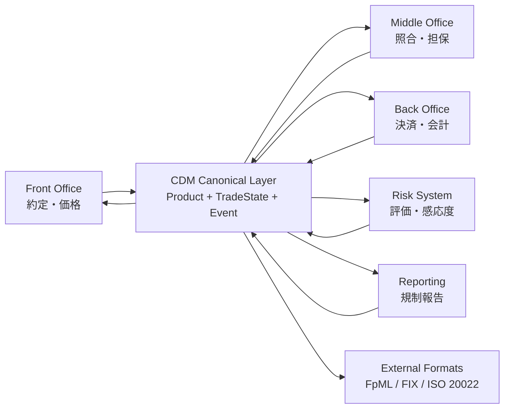
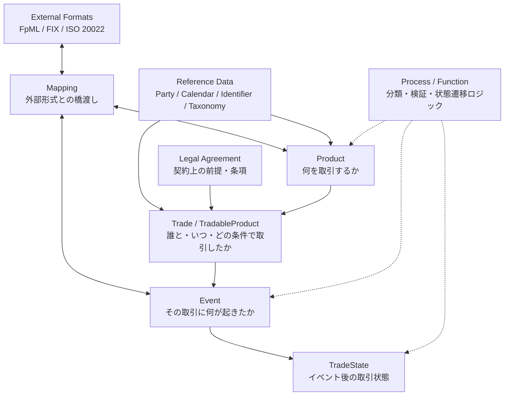
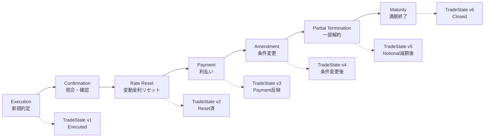
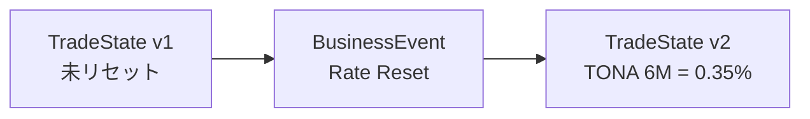
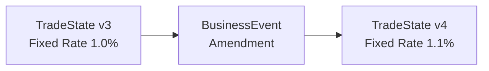
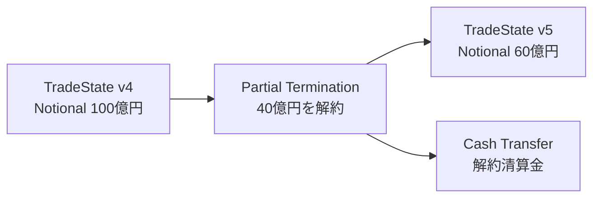
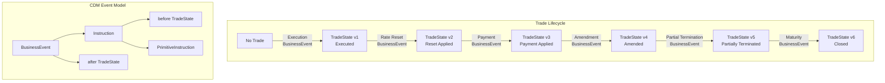

<!-- _class: lead -->

# CDMについて

## 金融取引をシステム間で同じ意味で扱うための共通モデル

---

## この資料で説明したいこと

CDMは、取引管理システムそのものではない。

CDMは、金融取引を

```text
何を取引するか
何が起きたか
誰が関係するか
どの契約・条件に基づくか
どのように処理するか
```

を共通のデータモデルとロジックで表すための標準。

特にこの資料では、CDM全体の中で重要な入口になる

```text
Product Model: 何を取引するか
Event Model:   その取引に何が起きたか
```

を中心に見る。

---

## 目次

1. **なぜCDMが必要か**  
   複数システムで同じ取引を同じ意味で扱う難しさ

2. **CDMとは何か**  
   標準データモデル・共通ロジックとしての位置づけ

3. **CDMの全体地図**  
   Product / Event / Legal Agreement / Process / Reference Data / Mapping の関係

4. **Product Model**  
   何を取引するか

5. **Event Model**  
   その取引に何が起きたか

6. **IRSの具体例**  
   ProductとEventをつなげて読む

---

<!-- _class: lead section-title -->

# 1. なぜCDMが必要か

## 問題は「データ形式」ではなく「意味のズレ」

---

## CDMのモチベーション

金融機関内では、同じ取引が複数のシステムで扱われる。

```text
Booking
Risk
Settlement
Accounting
Reporting
Confirmation
Collateral
```

しかし、各システムが異なる形式・異なる粒度・異なる解釈で取引を持つと、照合差異、評価差異、報告不一致、手作業補正が発生する。

> 問題は「データ形式が違う」だけではなく、  
> 同じ取引を同じ意味で解釈できないこと。

---

<!-- _class: small -->

## よくある課題：同じ取引がシステムごとに違う形になる

例：JPY Fixed-Float IRSを約定した場合

| システム | 持っている情報 | よく起きる問題 |
|---|---|---|
| 約定システム | 約定条件、相手先、価格 | 商品構造が簡略化される |
| リスクシステム | キャッシュフロー、感応度 | ブッキングの粒度が違う |
| 決済システム | 支払日、支払額、通貨 | イベント履歴が弱い |
| 報告システム | 規制報告項目 | 商品分類・イベント分類が別管理 |

結果として、同じ取引なのに、

```text
商品分類が違う
Notionalの解釈が違う
支払イベントの扱いが違う
変更・解約後の状態が追えない
```

ということが起きる。

---

<!-- _class: lead section-title -->

# 2. CDMとは何か

## 金融取引を共通語彙・共通データ形式・共通ロジックで表す

---

## CDMとは何か

CDMは、金融商品の取引・管理・ライフサイクルイベントを、共通のデータモデルとロジックで表現するためのデータモデルとロジック。

実体は、金融ドメイン専用の言語（DSL）で定義されたデータクラスと関数定義。OSSとしてGitHubからダウンロード可能。

```text
CDM = Common Domain Model
```

CDMは、金融取引を

```text
machine-readable
machine-executable
```

な形で表すための blueprint と考えるとよい。

---

## CDMは何ではないか

CDMは、取引管理システムそのものではない。

| 誤解 | 実際 |
|---|---|
| CDMを入れれば取引管理できる | CDMは標準モデルであり、アプリではない |
| CDM JSONがそのままDB設計になる | CDMは論理モデルであり、物理DB設計ではない |
| CDMは商品分類マスタである | Productは経済条件自体を表すモデル |
| CDMはデータ項目表である | データ構造だけでなくロジックも含む |

---

## CDMを使うと何が嬉しいか

CDMを共通レイヤーとして使うと、各システムが同じ取引を同じ意味で解釈しやすくなる。

```text
Booking System
      ↓
  CDM形式
      ↓
Risk / Settlement / Reporting / Accounting
```

期待される効果：

- システム間連携の変換コストを下げる
- 照合差異・解釈差異を減らす
- ライフサイクルイベントを一貫して扱う
- 報告・自動化・監査証跡に使いやすくする

---

<!-- _class: small -->

## CDMの使い道：システム間の共通データモデル

CDMは、各システムを置き換えるものではなく、システム間で受け渡す金融取引データの**共通モデル**として使える。



> 各システムの内部モデルを完全に統一するのではなく、  
> システム間の受け渡しで「共通の意味」を揃える。

---

## 代表的なユースケース

| ユースケース | CDMが役立つところ |
|---|---|
| **システム間連携（社内）** | Booking、Risk、Settlement、Reportingの間で取引表現を揃える |
| 取引照合（社外） | 相手先と商品条件・イベント条件を同じ構造で比較する |
| 規制報告（社外） | 商品分類・ライフサイクルイベント・当事者情報を一貫して扱う |
| **ライフサイクル管理（社内）** | Amendment、Termination、Reset、Paymentを状態遷移として扱う |
| **自動化 / STP（社内外）** | データだけでなく分類・検証・処理ロジックも標準化する |
| **データレイク（社内外）** | 複数システムの取引データを共通語彙で蓄積する |

---

## CDMはフルセットで使うとは限らない

CDMは広いモデルだが、各システムが常に全領域を使わなくてもよい。

```text
CDM内の主な領域
  Product
  Event
  Legal Agreement
  Process / Function
  Reference Data
  Mapping
```

たとえば、評価・リスク計算システムは、まずは **Product / EconomicTerms / Payout** を入力として読めればよい場合がある。

> CDMは「全部使うか、使わないか」ではなく、  
> システムの目的に応じて必要な領域を使う。

---

<!-- _class: small -->

## システムごとに読むCDMの範囲は違う

| システム | 主に必要なCDM領域 | 使い方 |
|---|---|---|
| Booking System | Product + Trade + Event | 約定・変更・解約を管理 |
| Risk System | Product + Reference Data | 評価・感応度計算の入力として使う |
| Confirmation / Matching | Product + Trade + Party + Legal Terms | 取引条件照合に使う |
| Reporting System | Product + Event + Party + Taxonomy | 規制報告・取引報告に使う |
| Settlement System | Event + Transfer + SettlementTerms | 支払・受渡処理に使う |
| Document System | Legal Agreement + Product | 契約書条項と取引条件の対応を見る |

---

## 「CDMを使う」にも濃淡がある

CDMの利用方法には段階があってよい。

```text
Level 1: 共通語彙として使う
  Product, Payout, Eventなどの概念を揃える

Level 2: インターフェース形式として使う
  システム間連携のデータ形式をCDM準拠にする

Level 3: 内部データモデルとして使う
  システム内部でもCDM構造で保持する

Level 4: ロジックまで使う
  Product QualificationやEvent処理ロジックも利用する
```

最初からLevel 4まで行く必要はない。

---

<!-- _class: lead section-title -->

# 3. CDMの全体地図

## Product / Eventに入る前に、各構成要素の役割を見る

---

## CDMは6つの観点から構成される

- **Product**  
  取引可能な金融商品の経済効果の定義

- **Event**  
  金融取引のライフサイクルイベントのデータ構造

- **Legal Agreement**  
  取引の契約・法的条件のデジタル表現

- **Process**  
  業界プロセスを機械可読・実行可能な形式にしたもの

- **Reference Data**  
  他の領域をモデル化するために必要な参照データ

- **Mapping**  
  FIX、FpML、ISO 20022など他形式へのマッピング

---

## CDMの各構成要素はどう関わるか

※ 厳密な型依存関係ではなく、理解のための概念図。



---

## CDMを3層で見る

CDMは、金融取引を表すための部品を大きく3つの役割で見ると分かりやすい。

| 役割 | CDMの要素 | 何をするか |
|---|---|---|
| 取引を表す | Product / Event / Legal Agreement | 商品、イベント、契約条件を表す |
| 土台を提供する | Reference Data | Party、暦、識別子、分類などを提供する |
| つなぐ・動かす | Mapping / Process | 外部形式とつなぎ、分類・検証・処理を実行する |

この資料では、まず取引表現の中心である **Product** と **Event** に絞って見る。

---

## ProductとEventはCDMの中心的な2軸

金融取引を理解するには、まず2つの問いに分ける。

```text
何を取引するか？
  → Product Model

その取引に何が起きたか？
  → Event Model
```

例：Fixed-Float IRS

```text
Product:
  固定レグ + 変動レグ + Notional + スケジュール

Event:
  新規約定、リセット、支払、条件変更、一部解約、満期

TradeState:
  各Eventの結果として、その時点の取引状態を表す
```

---

## なぜProductとEventを見るのか

CDM全体は広いが、取引を理解する入口はこの2つ。

| 問い | 見るモデル | 例 |
|---|---|---|
| 何を取引するか | Product Model | IRSの固定レグ・変動レグ・Notional |
| 何が起きたか | Event Model | 約定、リセット、支払、条件変更 |
| 今どういう状態か | TradeState | 約定済、支払済、一部解約後 |

ProductとEventを押さえると、

```text
取引の構造
時間の中での変化
現在の状態
```

を分けて読めるようになる。

---

## CDMの基本設計思想

CDMは、単なるデータ項目集ではなく、金融取引を標準化・自動化するための設計思想を持つ。

| 設計思想 | 意味 |
|---|---|
| Normalisation | 共通概念を抽象化して再利用する |
| Composability | 小さな部品を組み合わせて対象を表す |
| Mapping | FpML、FIX、ISO 20022など既存形式と対応づける |
| Embedded logic | 検証・分類・状態遷移などのロジックも持つ |
| Modularisation | 名前空間・レイヤーでモデルを整理する |

---

<!-- _class: small -->

## 設計思想はProductモデルにも現れる

Productモデルは、CDMの設計思想を強く反映している。

| 設計思想 | Productモデルでの現れ方 |
|---|---|
| Normalisation | price、quantity、party、settlementなどを共通化 |
| Composability | PayoutやUnderlierを組み合わせて商品を作る |
| Mapping | FpMLなど外部分類・外部項目との対応を持てる |
| Embedded logic | Product Qualificationで商品分類を推論する |
| Modularisation | product、base、observableなどの領域に分かれる |

> Productモデルが複雑に見えるのは、  
> 商品ごとの個別実装ではなく、共通部品で表そうとしているから。

---

## ここまでの整理

ここまでの話を一言でまとめると、CDMは次のように読める。

```text
Reference Data
  取引表現を支える共通情報

Product
  何を取引するか

Trade / TradeState
  誰と取引し、今どういう状態か

Event
  その取引に何が起きたか

Process / Mapping
  処理し、外部形式とつなぐ
```

この後は、まず **Product Model**、次に **Event Model** を見る。

---

<!-- _class: lead section-title -->

# 4. Product Model

## 何を取引するか

---

## CDMのProductモデルとは

CDMのProductモデルは、金融商品を **商品名ではなく、将来発生する支払・受渡・観測・決済のルール** として表現するモデル。

例：

```text
金利スワップ
= 固定金利レグ
+ 変動金利レグ
+ Notional
+ 支払日
+ 日数計算
+ 金利インデックス
```

商品名が先に来るのではなく、経済条件が先に来る。

---

## Productの前に：Asset / Observable / Product

CDMでは、参照されるもの・取引されるものを分けて考える。

| 概念 | ざっくり意味 | 例 |
|---|---|---|
| Asset | 識別可能な資産 | 株式、債券、ローン、通貨 |
| Observable | 価格・レートなどを観測する対象 | 株価、金利指数、FXレート、株価指数 |
| Product | 経済条件を持つ金融商品 | IRS、CDS、Repo、Swaption |

重要な違い：

> Productは `economicTerms` を持つ。  
> つまり、将来の支払・受渡の条件を持つ。

---

## Productには2種類ある

CDMのProductは、大きく2種類に分かれる。

```text
choice Product:
  TransferableProduct
  NonTransferableProduct
```

| 種類 | 意味 | 例 |
|---|---|---|
| TransferableProduct | 移転可能な資産にEconomicTermsを付けたもの | 債券、ローンなど |
| NonTransferableProduct | 二者間で合意される契約型の商品 | IRS、CDS、Repo、Swaptionなど |

この資料では、主に **NonTransferableProduct = 契約型の商品** を中心に見る。

---

## 考え方①：商品は部品の合成

CDMでは、商品を巨大な専用クラスとして表すのではなく、共通部品を組み合わせて表す。

```text
Product
  └─ Identifier
  └─ EconomicTerms      ←経済効果の情報が詰まったもの
       ├─ effectiveDate
       ├─ terminationDate
       └─ payout[]      ←将来の経済的なやり取りを指定する。経済効果に合わせて型を使い分ける
```

重要な見方：

> Product = EconomicTermsを持つもの

---

## 考え方②：商品名は後から推論する

CDMでは最初から

```text
productType = Interest Rate Swap
```

と書くのではない。代わりに、

```text
固定レグがある
変動レグがある
支払条件がある
```

という経済条件を書く。

その結果として、Product Qualificationにより `InterestRate_IRSwap_FixedFloat` のような分類が付く。

---

## 考え方③：ProductとTradeを分ける

商品そのものと、実際の取引条件は分けて考える。

```text
Product
= 商品の経済条件

TradableProduct
= Product + 価格 + 数量 + 当事者

Trade
= TradableProduct + 約定情報 + ライフサイクル情報
```

Productは「何を取引するか」。  
Tradeは「誰と、いつ、どの条件で取引したか」。

---

## Productモデルの中心：EconomicTerms

`EconomicTerms` は商品の心臓部。

```text
EconomicTerms
  ├─ effectiveDate
  ├─ terminationDate
  ├─ dateAdjustments
  ├─ payout[]
  ├─ terminationProvision
  ├─ calculationAgent
  └─ collateral
```

特に重要なのは `payout[]`。

---

## Payout：支払・受渡の部品

Payoutは、将来発生する金融上の義務を表す。Payoutは複数の具体的なタイプに分類される。
Payoutは後述のPayoutBaseという基底クラスのようなものを継承して作られている。

```text
choice Payout:
  AssetPayout
  CommodityPayout
  CreditDefaultPayout
  FixedPricePayout
  InterestRatePayout
  OptionPayout
  PerformancePayout
  SettlementPayout
```

商品はPayoutの組み合わせとして定義される。

---

## 商品とPayoutの例

```text
金利スワップ
= InterestRatePayout
+ InterestRatePayout

CDS
= プレミアム支払
+ CreditDefaultPayout

Equity Swap
= InterestRatePayout
+ PerformancePayout

Swaption
= OptionPayout
  └─ underlier = Interest Rate Swap
```

商品名ではなく、Payoutの組み合わせを見る。

---

## PayoutBaseを見ると「支払の共通項目」がわかる

PayoutBaseは、どのPayoutにも共通する「支払・受渡の基本情報」を持つ。

```text
PayoutBase
  ├─ payerReceiver
  ├─ priceQuantity
  ├─ principalPayment
  └─ settlementTerms
```

Payoutの種類が変わっても、見る観点は同じ。

```text
支払方向
金額・数量の決め方
元本交換の有無
決済方法
```

---

## 例：固定金利レグなら

```text
payerReceiver
  Party1がParty2に支払う

priceQuantity
  Notional = 100億円
  Fixed Rate = 1.0%

principalPayment
  元本交換なし

settlementTerms
  JPYで現金決済
```

PayoutBaseを見ると、**このPayoutがどちら向きに、どの条件で、どう決済されるか**が分かる。

---

## Underlier：商品を商品の中に入れる

`Underlier` は、ある商品や資産を別の商品から参照する仕組み。

例：

```text
株式オプション
= OptionPayout
  └─ underlier = Equity

スワップション
= OptionPayout
  └─ underlier = Interest Rate Swap

インデックス連動商品
= PerformancePayout
  └─ underlier = Index
```

この仕組みにより、CDMは複雑な商品も合成的に表せる。

---

## Product Modelの考え方のたとめ

Product Modelは、次の考え方に則っている。

> 商品名を保存するためのモデルではなく、  
> 商品名を推論できるだけの経済条件を表すモデル。

特にpayoutを複数組み合わせてさまざまな経済効果を表現。

```text
Product
  └─ EconomicTerms
       └─ payout[]
```

---

<!-- _class: lead section-title -->

# 5. Productの具体例

## Fixed-Float IRSを段階的にCDM化する

---

## 例：Fixed-Float IRSを自然言語で表す

まずは自然言語で商品を表す。

```text
Party1は固定金利を支払う
Party2は変動金利を支払う

Notionalは100億円
固定金利は1.0%
変動金利はTONA 6M
年2回支払う
満期は5年
元本交換はない
JPYで現金決済
```

ここではまだCDMの型は意識しない。

---

<!-- _class: small -->

## Step 1：Payoutに分解する

Fixed-Float IRSは、2本の金利Payoutとして見る。

```text
Fixed Leg
= InterestRatePayout
  - payerReceiver: Party1 pays Party2
  - rateSpecification: fixed rate 1.0%
  - notional: 100億円
  - payment frequency: semi-annual

Floating Leg
= InterestRatePayout
  - payerReceiver: Party2 pays Party1
  - rateSpecification: TONA 6M
  - notional: 100億円
  - payment frequency: semi-annual
```

商品名ではなく、**2つのInterestRatePayoutの組み合わせ**として表す。

---

## Step 2：EconomicTermsに入れる

2つのPayoutを、ProductのEconomicTermsに格納する。

```text
NonTransferableProduct
  └─ economicTerms
       ├─ effectiveDate
       ├─ terminationDate
       └─ payout
            ├─ InterestRatePayout  fixed leg
            └─ InterestRatePayout  floating leg
```

この時点で、CDM的には

> 将来の支払義務を持つ契約型Product

として表現される。

---

## Step 3：Product Qualificationで分類される

CDMでは、最初から

```text
productType = Fixed-Float IRS
```

とは書かない。

代わりに、

```text
InterestRatePayoutが2本ある
片方がFixed
片方がFloating
元本交換なし
金利系の商品条件を満たす
```

という構造から、Product Qualification関数が `InterestRate_IRSwap_FixedFloat` のような分類を推論する。

---

<!-- _class: small -->

## IRSを擬似JSONで見る

実際のCDM JSONはもっと深いが、考え方は次のようになる。

```json
{
  "nonTransferableProduct": {
    "economicTerms": {
      "payout": [
        {
          "interestRatePayout": {
            "payerReceiver": { "payer": "Party1", "receiver": "Party2" },
            "priceQuantity": {
              "quantity": "JPY 10,000,000,000",
              "price": "Fixed Rate 1.0%"
            },
            "settlementTerms": { "settlementType": "Cash", "settlementCurrency": "JPY" }
          }
        },
        {
          "interestRatePayout": {
            "payerReceiver": { "payer": "Party2", "receiver": "Party1" },
            "priceQuantity": {
              "quantity": "JPY 10,000,000,000",
              "price": "Floating Rate TONA 6M"
            },
            "settlementTerms": { "settlementType": "Cash", "settlementCurrency": "JPY" }
          }
        }
      ]
    }
  }
}
```

---

## なぜ実際のCDM JSONは深くなるのか

金融商品は、見た目よりも多くのルールを持つ。

例：固定金利レグだけでも

```text
誰が払うか
Notionalはいくらか
固定金利はいくらか
計算期間はいつからいつまでか
支払日はいつか
休日ならどう調整するか
日数計算は何か
端数処理はどうするか
決済通貨は何か
```

CDMはこれらを、曖昧な文字列ではなく、機械可読な部品として持つ。

---

<!-- _class: lead section-title -->

# 6. Event Model

## その取引に何が起き、状態がどう変わったか

---

## Event Modelに入る前に：TradeStateとは何か

Product Modelでは「何を取引するか」を見た。

しかし実務では、取引は時間とともに状態が変わる。

```text
新規約定される
金利がリセットされる
支払が発生する
条件変更される
一部解約される
満期を迎える
```

CDMでは、その時点の取引状態を **TradeState** として表す。

> Event Modelは、TradeStateがイベントによってどう変化するかを見るモデル。

---

## Product / Trade / TradeState の関係

まず、3つを分けて考える。

```text
Product
  何を取引するか
  例：固定レグ + 変動レグ + Notional + スケジュール

Trade
  Productを、当事者・価格・数量・約定日などと結びつけたもの
  例：Party1とParty2が2026-04-01に約定したIRS

TradeState
  ある時点でのTradeの状態
  例：約定済、リセット済、支払済、一部解約後
```

Productは商品の構造、Tradeは実際の取引、TradeStateはその時点の状態。

---

## なぜTradeStateが必要か

取引は、ライフサイクルイベントのたびに変化する。

```text
TradeState v1
  約定済

TradeState v2
  変動金利リセット済

TradeState v3
  支払反映済

TradeState v4
  一部解約後
```

CDMでは、取引を雑に上書きするのではなく、  
**イベントによって新しいTradeStateが生まれる** と考える。

---

## TradeStateは何でできているか

`TradeState` は、取引そのものと、その時点の状態・履歴をまとめる箱。

```text
TradeState
  ├─ trade
  ├─ state
  ├─ resetHistory
  └─ transferHistory
```

| 要素 | 意味 | 例 |
|---|---|---|
| `trade` | 取引条件そのもの | Product、当事者、約定日、識別子 |
| `state` | その時点の状態 | open、closed、terminated |
| `resetHistory` | リセット履歴 | TONAの観測値、reset date |
| `transferHistory` | 支払・受渡履歴 | cash transfer、settlement status |

---

## Event Modelとは何か

Event Modelは、金融取引のライフサイクル上で **何が起きたか** を表すモデル。

例：

```text
新規約定
条件変更
リセット
支払
権利行使
一部解約
満期
```

ただしCDMでは、これらを単なるログではなく、  
**TradeStateを変化させるイベント**として表す。

---

## Event Modelの基本パターン

CDMでは、イベントは状態遷移として表される。

```text
before TradeState
  + PrimitiveInstruction
  ↓
Create_TradeState
  ↓
after TradeState
```

つまり、Event Modelで知りたいのは、

```text
どの取引状態に対して
どんな最小操作を適用し
結果としてどういう状態になったか
```

である。

---

## Event Modelの登場人物

初見では、まずこの4つを押さえる。

```text
BusinessEvent
  ├─ instruction[]
  │    ├─ before TradeState
  │    └─ primitiveInstruction
  └─ after TradeState[]
```

| 概念 | 役割 | イメージ |
|---|---|---|
| `TradeState` | ある時点の取引状態 | 約定後、リセット後、解約後 |
| `PrimitiveInstruction` | 状態変化の最小操作 | execution、reset、transfer、quantityChange |
| `Instruction` | どのTradeStateに何を適用するか | before + primitiveInstruction |
| `BusinessEvent` | 業務上意味のあるイベント | 約定、変更、解約、支払 |

---

## PrimitiveInstruction：状態変化の最小操作

`PrimitiveInstruction` は、TradeStateを変えるための最小単位。

```text
execution
  新しい取引を作る

quantityChange
  数量・Notionalを変える

termsChange
  商品条件を変える

partyChange
  当事者を変える

reset
  観測値・リセット値を記録する

transfer
  支払・受渡を記録する
```

BusinessEventは、これらのPrimitiveInstructionを組み合わせて表せる。

---

## Instruction：どの状態に何を適用するか

`Instruction` は、**どのTradeStateに、どんな操作を適用するか**を表す。

```text
Instruction
  ├─ before TradeState
  └─ primitiveInstruction
```

例：Notionalを100億円から60億円に減らす場合

```text
before TradeState:
  Notional = 100億円

primitiveInstruction:
  quantityChange = 40億円を減額

after TradeState:
  Notional = 60億円
```

---

## BusinessEvent：業務イベントのまとまり

`BusinessEvent` は、業務上意味のあるライフサイクルイベント。

```text
BusinessEvent
  ├─ instruction[]
  ├─ eventDate
  ├─ eventQualifier
  └─ after TradeState[]
```

例：Partial Termination

```text
BusinessEvent:
  eventQualifier = PartialTermination

instruction:
  before TradeState
  primitiveInstruction = quantityChange

after:
  Notional減額後のTradeState
```

---

## Product ModelとEvent Modelの違い

| モデル | 表すもの | 例 |
|---|---|---|
| Product Model | 何を取引するか | Fixed-Float IRS、Repo、Swaption |
| Trade | Productを取引条件と結びつけたもの | 当事者、約定日、取引ID |
| TradeState | ある時点での取引状態 | 約定済、リセット済、一部解約後 |
| Event Model | 何が起きたか | 約定、変更、支払、リセット、満期 |

ポイント：

> Productは商品の構造を表す。  
> Eventは、その商品を含む取引が時間の中でどう変化したかを表す。

---

## Event Modelの考え方のまとめ

Event Modelは、次のように読む。

```text
TradeState before
  いまの取引状態

PrimitiveInstruction
  状態を変える最小操作

BusinessEvent
  業務上意味のあるイベントとしてまとめたもの

TradeState after
  イベント適用後の取引状態
```

> 取引を上書き更新するのではなく、  
> `before TradeState → after TradeState` の連鎖として表す。

---

<!-- _class: lead section-title -->

# 7. Eventの具体例

## IRSのライフサイクル管理

---

## 例：5年JPY Fixed-Float IRSのライフサイクル

前提：

```text
商品：JPY Fixed-Float IRS
Trade Date：2026-04-01
Effective Date：2026-04-03
Maturity：2031-04-03
Notional：100億円
Fixed Leg：Party1 pays 1.0%
Floating Leg：Party2 pays TONA 6M
Payment：Semi-Annual
```

Product Modelでは、これは

```text
NonTransferableProduct
  └─ EconomicTerms
       └─ payout[]
            ├─ InterestRatePayout fixed leg
            └─ InterestRatePayout floating leg
```

として表される。

---

## ライフサイクルの全体像



イベントが発生するたびに、取引の状態が更新される。

---

## 例1：新規約定 Execution

```text
イベント：
  Execution / Contract Formation

before:
  なし

after:
  TradeState v1
    - Trade exists
    - positionState = Executed
    - Product = Fixed-Float IRS
    - Counterparty = Party1 / Party2
```

イメージ：

```text
何もない状態
  ↓ 新規約定イベント
TradeState v1: IRSが存在する状態
```

---

## 例2：金利リセット Rate Reset

変動レグのTONA 6Mが決まり、次回支払額を計算できるようになる。



```text
before:
  Floating rate for next period is not fixed yet

event:
  Reset rate = 0.35%

after:
  Floating rate for target period = 0.35%
```

Productそのものを雑に書き換えるのではなく、「リセットというイベントが起きた結果、取引状態が変わった」と表す。

---

## 例3：利払い Payment

支払日に、固定レグと変動レグのネット支払が発生する。

```text
イベント：
  Payment

before:
  TradeState v2
    - Reset済
    - 支払額計算可能

event:
  Fixed leg amount = 50,000,000 JPY
  Floating leg amount = 17,500,000 JPY
  Net payment = 32,500,000 JPY from Party1 to Party2

after:
  TradeState v3
    - 対象期間の支払が反映済
```

---

## 例4：条件変更 Amendment

固定金利を1.0%から1.1%に変更した場合。



```text
before:
  Fixed Rate = 1.0%
  Notional = 100億円

event:
  Fixed Rateを1.1%に変更
  Effective from 2027-04-03

after:
  Fixed Rate = 1.1%
  その他条件は維持
```

---

## 例5：一部解約 Partial Termination

Notionalを100億円から60億円に減額するケース。



```text
before:
  Notional = 100億円

event:
  Terminated notional = 40億円
  Remaining notional = 60億円
  Termination payment = x JPY

after:
  Notional = 60億円
  残存取引として継続
```

---

<!-- _class: small -->

## 1枚で見る：CDM Event Modelとライフサイクル



---

## ProductとEventの関係

Productは「契約上の経済条件」を表す。

Eventは、

```text
新規約定
変更
解約
決済
権利行使
リセット
```

のような、取引状態の変化を表す。

重要な考え方：

> Productはライフサイクルイベントのたびに雑に上書きされるものではない。  
> Eventによって、取引状態がどう変化したかを表す。

---

## ProductとEvent Modelのまとめ

Product Model：

1. まず `Product → EconomicTerms → payout[]` が経済効果の表現の中心
2. 商品名ではなくPayoutの組み合わせで考える
3. `PayoutBase` で支払方向・数量・決済が決まる
4. 金利商品なら日付・スケジュール系がある
5. Product Qualificationは最後にデータの構造からパースされる

Event Modelを読むとき：

1. `before TradeState` を見る
2. `BusinessEvent` が何かを見る
3. `Instruction / PrimitiveInstruction` を見る
4. `after TradeState` がどう変わったかを見る

---

<!-- _class: lead section-title -->

# 8. まとめ

## Productは構造、Eventは変化、TradeStateは状態

---

## まとめ

CDMは、金融取引を複数システム間で同じ意味で扱うための **共通データモデル・共通ロジック** である。

```text
Product Model
  = 何を取引するか

Event Model
  = その取引に何が起きたか
```

CDMのProductモデルは、商品名のマスタではなく、将来の経済的な義務の部品表として金融商品を表す。

CDMのEventモデルは、取引を上書き更新するのではなく、BusinessEventによる `before TradeState → after TradeState` の連鎖として表す。

---

## 最後に：CDMをどう捉えるとよさそうか（個人の見解）

CDMは、全システムに同じ実装を強制しなくても良い。

各システムが、自分の目的に必要なCDM領域だけを読みながら、同じ実世界の取引を同じ意味で扱えるようにするための共通言語としての使い方もあり得る。

```text
Risk System
  Product中心

Lifecycle / Booking
  Product + Event + TradeState

Reporting
  Product + Event + Party + Taxonomy

Settlement
  Event + Transfer + SettlementTerms
```

> CDMは「全部使う巨大モデル」ではなく、  
> 金融取引を共通語彙でつなぐためのレイヤーとして使える。


---

<!-- _class: lead section-title -->

# Appendix

## 他の商品でProduct / Eventの見え方を確認する

---

## Appendixの位置づけ

本編では、Fixed-Float IRSを使って

```text
Product
  = 何を取引するか

Event
  = その取引に何が起きたか

TradeState
  = Event後の取引状態
```

を見た。

Appendixでは、同じ見方を別の商品にも当てはめる。

```text
CDS
  CreditDefaultPayoutを含む例

Equity Swap
  PerformancePayoutとリセット・数量変化を見る例
```

---

<!-- _class: lead section-title -->

# Appendix A. CDS

## CreditDefaultPayoutを持つ商品

---

## CDSを自然言語で表す

例：Single-name CDS

```text
Protection Buyerは定期的にプレミアムを支払う
Protection Sellerは信用イベント発生時に損失補填を行う

Reference Entity: Company X
Reference Obligation: Company X Bond
Notional: 100億円
Premium: 100bp / 年
Maturity: 5年
Credit Event: Bankruptcy / Failure to Pay / Restructuring
Settlement: Cash Settlement または Physical Settlement
```

CDSは、平常時のプレミアム支払と、信用イベント時の支払が組み合わさった商品として読む。

---

## CDSをPayoutに分解する

CDSは、概念的には2つの経済効果に分けて考える。

```text
Premium Leg
= Protection Buyer が定期的にプレミアムを支払う

Protection Leg
= CreditDefaultPayout
  - Reference Entity / Reference Obligation
  - Credit Event
  - Settlement Terms
  - Notional
```

CDM上では、信用イベント時の支払・決済条件が `CreditDefaultPayout` によって表現される。

ポイント：

> IRSが `InterestRatePayout` の組み合わせだったのに対し、  
> CDSでは信用イベントに紐づく `CreditDefaultPayout` が中心になる。

---

## CDSをEconomicTermsに入れる

```text
NonTransferableProduct
  └─ economicTerms
       ├─ effectiveDate
       ├─ terminationDate
       └─ payout[]
            ├─ InterestRatePayout / FixedAmount系のPremium Leg
            └─ CreditDefaultPayout  protection leg
```

見るべきポイントは、IRSと同じ。

```text
どんなPayoutがあるか
誰が払うか / 受けるか
何を参照するか
どのイベントで支払が発生するか
どう決済するか
```

---

## CDSのライフサイクル例

CDSでは、通常の支払イベントに加えて、信用イベントの有無が重要になる。

```text
Execution
  CDS取引が成立する

Premium Payment
  定期的なプレミアム支払が発生する

Credit Event Notice
  信用イベント発生が通知される

Settlement
  Cash Settlement または Physical Settlementを行う

Termination / Maturity
  満期または信用イベント決済により終了する
```

CDM的には、これらはEventによってTradeStateを変化させるものとして扱う。

---

## CDSのEventを状態遷移で見る

```text
TradeState v1
  CDS約定済
  Credit Event未発生

↓ Premium Payment Event

TradeState v2
  対象期間のプレミアム支払済

↓ Credit Event Event

TradeState v3
  Credit Event発生済
  Settlement対象

↓ Settlement Event

TradeState v4
  Protection Leg決済済
  取引終了または残存状態へ
```

ポイント：

> Product側では「信用イベント時に何が起きる契約か」を表し、  
> Event側では「実際に信用イベントや決済が起きた事実」を表す。

---

<!-- _class: small -->

## CDSを擬似JSONで見る

```json
{
  "nonTransferableProduct": {
    "economicTerms": {
      "payout": [
        {
          "interestRatePayout": {
            "payerReceiver": { "payer": "ProtectionBuyer", "receiver": "ProtectionSeller" },
            "priceQuantity": {
              "quantity": "JPY 10,000,000,000",
              "price": "Premium 100bp"
            }
          }
        },
        {
          "creditDefaultPayout": {
            "payerReceiver": { "payer": "ProtectionSeller", "receiver": "ProtectionBuyer" },
            "referenceEntity": "Company X",
            "referenceObligation": "Company X Bond",
            "creditEvents": ["Bankruptcy", "FailureToPay", "Restructuring"],
            "settlementTerms": {
              "settlementType": "Cash or Physical"
            }
          }
        }
      ]
    }
  }
}
```

※ 理解用の擬似JSON。実際のCDM JSONでは、参照債務、信用イベント、決済条件などがより細かい型で表現される。

---

<!-- _class: lead section-title -->

# Appendix B. Equity Swap

## PerformancePayoutと変化する数量を見る

---

## Equity Swapを自然言語で表す

例：Single-name Equity Swap

```text
Party1は株式リターンを受け取る
Party2は金利ベースのFunding Legを受け取る

Underlying: Stock A
Initial Price: 1,000円
Initial Quantity: 1,000,000 shares
Initial Equity Notional: 10億円
Funding Leg: TONA + spread
Reset: 各評価日に株価を観測
Settlement: 株式リターンとFundingを差金決済
```

Equity Swapは、株式のパフォーマンスを参照するレグと、金利・資金調達コストを参照するレグの組み合わせとして読む。

---

## Equity SwapをPayoutに分解する

```text
Equity Return Leg
= PerformancePayout
  - underlier / observable: Stock A
  - initial price: 1,000円
  - quantity: 1,000,000 shares
  - final price: resetで観測
  - return: final price - initial price

Funding Leg
= InterestRatePayout
  - notional: equity notional相当
  - rate: TONA + spread
  - quantityが株価・評価額に応じて変わりうる
```

ポイント：

> `PerformancePayout` は、Observableの価格変化からリターンを計算するレグ。  
> Funding Leg側の数量・Notionalは、株価やリセット値に応じて変化しうる。

---

## PriceQuantityで株式リターンの材料を持つ

Equity SwapのReturn Legでは、`PriceQuantity` が特に分かりやすい。

```text
PriceQuantity
  ├─ observable: Stock A
  ├─ quantity: 1,000,000 shares
  └─ price: Initial Price = 1,000円 / share
```

この3つがそろうと、初期時点の株式Notionalが決まる。

```text
Initial Equity Notional
= 1,000,000 shares × 1,000円
= 10億円
```

公式ドキュメントでも、Equity Swapのreturn legでは、株式識別子が`observable`、株数が`quantity`、初期株価が`price`として扱われる例が示されている。

---

## PerformancePayoutとResetの関係

Equity Swapでは、将来の評価日に株価を観測する。

```text
TradeState v1
  Initial Price = 1,000円
  Quantity = 1,000,000 shares

↓ Reset Event

TradeState v2
  Reset Price = 1,100円
  Performance = +100円/share

↓ Transfer Event

TradeState v3
  Equity Return Cashflowを支払済
```

ここで重要なのは、観測値そのものはEventによってTradeStateの履歴に反映されること。

```text
resetHistory
  └─ resetValue = 1,100円
```

---

## 数量・Notionalが変わるイメージ

Equity Swapでは、Funding LegのNotionalが株式価値に連動する設計がありうる。

```text
Date 0
  Stock Price = 1,000円
  Quantity = 1,000,000 shares
  Equity Notional = 10億円

Reset Date 1
  Stock Price = 1,100円
  Quantity = 1,000,000 shares
  Equity Notional = 11億円

Reset Date 2
  Stock Price = 900円
  Quantity = 1,000,000 shares
  Equity Notional = 9億円
```

この場合、株数は一定でも、評価額ベースのNotionalは毎回変わる。

> 「quantityが毎回変わる」というより、  
> 契約上の設計によっては、参照する数量・Notionalがリセット値から解決される。

---

## ResolvablePriceQuantityで見る

CDMでは、Payout側の数量・価格は `ResolvablePriceQuantity` として扱われる。

```text
ResolvablePriceQuantity
  ├─ quantitySchedule
  ├─ quantityReference
  ├─ quantityMultiplier
  ├─ reset
  ├─ futureValueNotional
  └─ priceSchedule
```

これにより、Payoutの数量を単なる固定値ではなく、他のPriceQuantityや観測値から解決できる。

例：Equity SwapのFunding Leg

```text
Funding Notional
= 株数 × Reset後の株価
```

のような値を、リセットや参照関係を通じて扱うイメージ。

---

<!-- _class: small -->

## Equity Swapを擬似JSONで見る

```json
{
  "nonTransferableProduct": {
    "economicTerms": {
      "payout": [
        {
          "performancePayout": {
            "payerReceiver": { "payer": "Party2", "receiver": "Party1" },
            "underlier": { "observable": "Stock A" },
            "priceQuantity": {
              "observable": "Stock A",
              "quantity": "1,000,000 shares",
              "price": "Initial Price 1,000 JPY/share"
            },
            "settlementTerms": { "settlementType": "Cash" }
          }
        },
        {
          "interestRatePayout": {
            "payerReceiver": { "payer": "Party1", "receiver": "Party2" },
            "rateSpecification": "TONA + spread",
            "priceQuantity": {
              "quantityReference": "Equity Notional",
              "reset": true
            },
            "settlementTerms": { "settlementType": "Cash" }
          }
        }
      ]
    }
  }
}
```

※ 理解用の擬似JSON。実際のCDM JSONでは、`PerformancePayout`、`ResolvablePriceQuantity`、観測・リセット・決済条件がより細かい型で表現される。

---

## Equity SwapのEventを状態遷移で見る

```text
TradeState v1
  Product: PerformancePayout + InterestRatePayout
  Initial Price = 1,000円
  Quantity = 1,000,000 shares

↓ Reset Event

TradeState v2
  resetHistoryに観測株価を追加
  Reset Price = 1,100円

↓ Calculation / Transfer Event

TradeState v3
  Equity ReturnとFunding Amountを計算
  Cash Transferを記録
```

ポイント：

> Productは「株式リターンを参照する契約」を表す。  
> Eventは「実際に株価を観測し、支払・受渡が発生したこと」を表す。

---

## Appendixのまとめ

IRS、CDS、Equity Swapは、それぞれ中心になるPayoutが違う。

| 商品 | 中心になるPayout | 見るべきポイント |
|---|---|---|
| IRS | `InterestRatePayout` | 固定・変動レグ、スケジュール、金利リセット |
| CDS | `CreditDefaultPayout` | 信用イベント、参照債務、決済方法 |
| Equity Swap | `PerformancePayout` | Observable、PriceQuantity、Reset、Performance |

ただし、読み方は共通。

```text
Product
  どんなPayoutで構成されるか

Event
  そのPayoutに関係する観測・支払・変更がいつ起きたか

TradeState
  Event後に取引がどういう状態になったか
```

---

## Appendix参考リンク

- CDM Product Model  
  https://cdm.finos.org/docs/product-model/

- CDM Process Model  
  https://cdm.finos.org/docs/process-model/

- CDM Event Model  
  https://cdm.finos.org/docs/event-model/


---

## 参考リンク

- CDM Overview  
  https://cdm.finos.org/docs/cdm-overview/

- CDM Design Principles  
  https://cdm.finos.org/docs/design-principles/

- CDM Product Model  
  https://cdm.finos.org/docs/product-model/

- CDM Event Model  
  https://cdm.finos.org/docs/event-model/

- ICMA: Common Domain Model  
  https://www.icmagroup.org/market-practice-and-regulatory-policy/repo-and-collateral-markets/fintech/common-domain-model-cdm/
