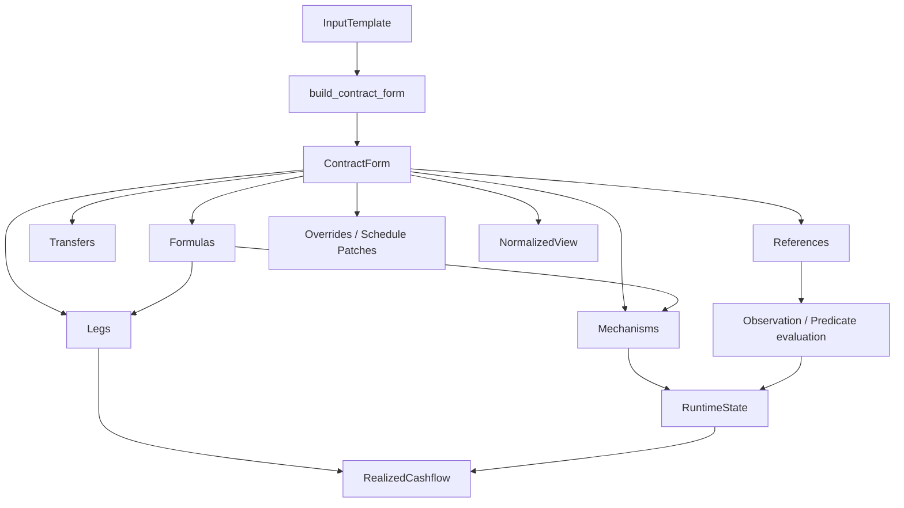
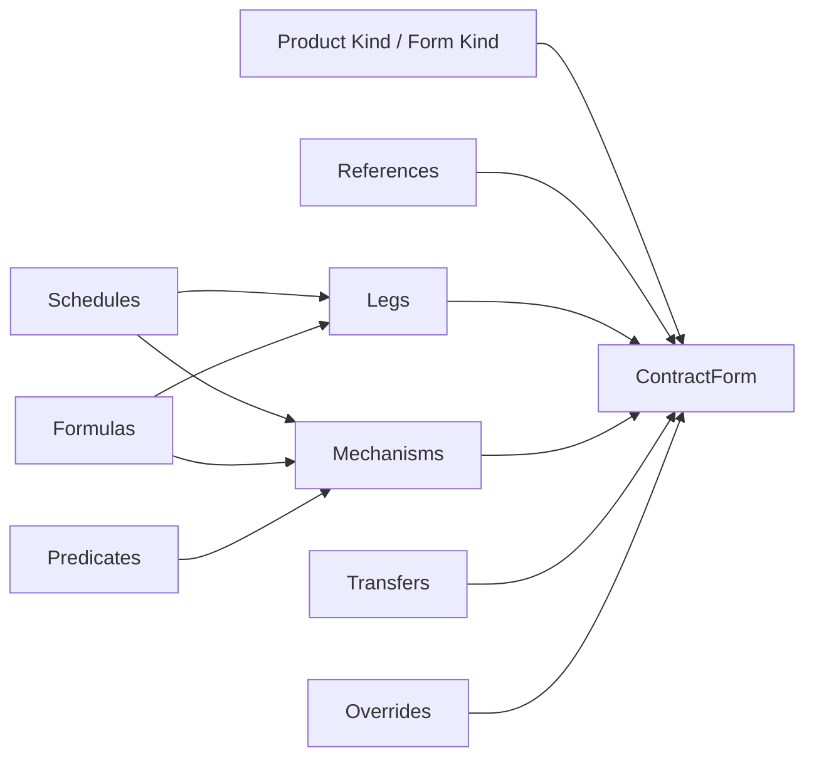
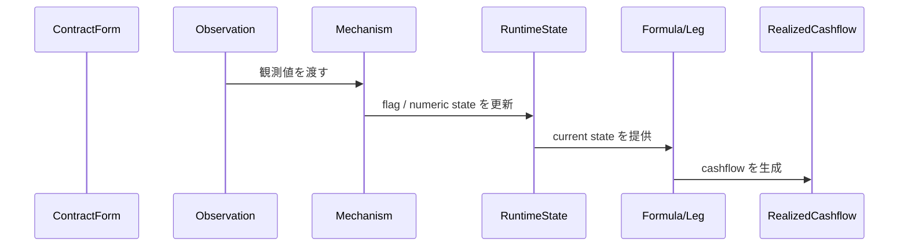

# Form-first Derivative Contract Model

この文書は、`contract_model.py` に実装した **Form-first Derivative Contract Model** の詳細設計書である。  
モデルの中心思想は、**契約形態を第一情報として保持しつつ、比較・共通処理・状態遷移も扱えるようにする** ことにある。

---

## 0. この設計が生まれた背景

この設計は、単に「デリバティブを Python のクラスで表したい」という話から始まったわけではない。背景には、次のような問題意識があった。

### 0.1 最初の問題意識

やりたかったことは、広い意味での **金融契約の表現方法** を作ることである。  
とくに重視していたのは、次のような点だった。

- 契約内容を **宣言的** に持ちたい
- 典型商品だけでなく、**仕組商品や例外条項** も扱いたい
- あとから契約を **編集・修正** しやすくしたい
- 契約形態としての違いを消さずに残したい
- ただし、必要なら異なる商品同士を **共通して比較・処理** もしたい

つまり、単なるプライシング用 payoff object では足りず、逆に単なる termsheet 的 JSON でも足りない、という立場である。

### 0.2 ACTUS / FpML / CDM をどう見るか

議論の途中で、ACTUS / FpML / CDM の役割の違いを整理した。

- **ACTUS** は、契約条件から cashflow / state transition を生成する、かなり **計算寄り** の標準
- **FpML** は、商品ごとの契約条件やメッセージ交換に強い、かなり **form / exchange 寄り** の標準
- **CDM** は、経済的意味や lifecycle event を共通化する、かなり **meaning / state transition 寄り** のモデル

ここから見えてきたのは、次の事実だった。

1. 契約管理の主表現を ACTUS にするのは重い
2. FpML の発想は **契約形態を残す** 点で有用
3. CDM の発想は **共通比較・共通処理・状態遷移** に有用
4. しかし CDM をそのまま source of truth にすると、元の入力意図や契約形態がぼやけやすい

### 0.3 「テンプレート」について再定義が必要になった

途中で「テンプレート」という言葉を使っていたが、議論を進めるうちに、それが少なくとも 2 種類あることが分かった。

#### A. 入力テンプレート
ユーザーが少数の代表パラメータだけを入れるためのもの。

#### B. 契約テンプレート
商品種別ごとに、使える payout / rule / mechanism の組み合わせを制限した、正式な authoring schema。

そして本当に source of truth になるべきなのは、後者に近いものだった。  
単なる入力フォームではなく、**編集可能で、例外も受け止められる product grammar** が必要だった。

### 0.4 「スケジュール + ペイオフ + KO」では足りなかった

最初の直観として、商品は

- スケジュール
- ペイオフのルール
- KO ルール

に分解できるのではないか、という考え方があった。  
しかし Snowball / TARF / MtM notional swap を考えると、これだけでは不十分だった。

不足していたのは主に次である。

- **観測**: 何を、いつ、どう見るか
- **状態**: 過去の観測を踏まえた途中経過
- **状態遷移機構**: KO / KI / coupon memory / target accumulation / notional reset
- **イベント**: 実際に何が起きたか

ここで、path-dependent product を素直に扱うには、

- 静的な契約条項
- 動的な runtime state

を分ける必要がある、という結論に至った。

### 0.5 最終的に整理された要件

最終的に必要な要件は、次のように整理された。

#### 契約表現として必要なこと
- 契約形態を第一情報として保持する
- 同じ経済効果でも、別 form として保持できる
- schedule / step / override / irregular condition を正式サポートする
- product grammar として、商品ごとの許容構成を表せる

#### ユーザー入力として必要なこと
- 入力はなるべく少数パラメータで済ませたい
- ただし入力時点で **どの契約形態として起こすか** は指定したい
- 入力から正式な ContractForm への変換は **一意** にしたい

#### 共通処理として必要なこと
- 異なる商品形態でも、必要なら normalized な比較ができる
- runtime state を持つ商品を扱える
- MtM reset のような **観測に応じた将来パラメータ更新** を扱える

#### 実装アーキテクチャとして必要なこと
- InputTemplate / ContractForm / RuntimeState / NormalizedView を分離する
- payout primitive だけではなく、mechanism を導入する
- source of truth は normalized view ではなく ContractForm に置く

この README の残りは、その要件に対してどのような設計を採ったかを説明する。

---

## 1. 設計の結論

このモデルは、金融契約を次の 4 層で扱う。

1. **InputTemplate**  
   少数の代表パラメータを受ける、ユーザー向け入力層
2. **ContractForm**  
   契約形態を保ったまま永続化・編集する、source of truth
3. **RuntimeState**  
   観測・イベント処理の途中経過を保持する動的状態層
4. **NormalizedView**  
   異なる契約形態を横断して比較・検索・集計する派生ビュー

この分離により、

- ユーザー入力の簡便さ
- 契約形態としての厳密さ
- path-dependent product の扱いやすさ
- 異なる商品同士の共通比較

を同時に満たす。

---

## 2. 中核思想

### 2.1 ContractForm が原本

この設計では、永続化と編集の中心は `ContractForm` である。

`ContractForm` は次を持つ。

- `form_id`, `form_kind`
- `parties`
- `references`
- `transfers`
- `legs`
- `formulas`
- `mechanisms`
- `overrides`
- `schedule_patches`
- `tags`

重要なのは、**normalized view を原本にしない** ことである。  
Forward と Synthetic Forward が同じような経済効果を持っていても、原本では別 form として残す。

### 2.2 InputTemplate は入口であって原本ではない

InputTemplate は、ユーザーが

- underlier
- strike
- notional
- maturity
- product kind
- realization

のような代表パラメータだけで商品を起こせるようにするための層である。

ただし、InputTemplate だけでは

- 例外条項
- 局所修正
- schedule patch
- product-specific editing

を十分に保持できない。  
したがって、InputTemplate はあくまで **入口** であり、source of truth は ContractForm である。

### 2.3 Mechanism は「仕組み」を表す

Leg を増やしていくだけでは、Snowball や Autocallable のような商品で型が爆発しやすい。  
そこで、

- **Leg** は基礎となる経済流
- **Mechanism** は条件分岐・状態更新・活性/非活性を制御する仕組み

として分けた。

たとえば Snowball は、巨大な専用クラス 1 個で持つよりも、

- `CouponLeg`
- `CouponMemoryMechanism`
- `StepUpMechanism`
- `KnockOutMechanism`

の組み合わせで表す方が、構造が見えやすく拡張しやすい。

### 2.4 RuntimeState は条項とは別に持つ

Snowball / TARF / MtM notional swap のような商品では、将来 cashflow を決めるために途中経過が必要である。

例:

- `knocked_out`
- `knocked_in`
- `autocalled`
- `accumulated_target_amount`
- `memory_coupon_balance`
- `current_notional_pay_leg`

これらは契約条項そのものではなく、**契約条項を時系列で適用した途中経過** である。  
よって `RuntimeState` として別建てにしている。

---

## 3. 商品テンプレートの役割と考え方

### 3.1 本モデルにおける「テンプレート」の意味

この設計では、「テンプレート」という言葉を次の 2 段で使う。

#### 入力テンプレート (`InputTemplate`)
ユーザーが少数パラメータだけを指定するためのもの。

例:
- `ForwardInputTemplate`
- `SyntheticForwardInputTemplate`
- `VanillaOptionInputTemplate`
- `SnowballInputTemplate`
- `TarfInputTemplate`
- `MtMNotionalSwapInputTemplate`

#### 契約テンプレート / Product Grammar
ある商品種別で使える

- reference
- leg
- formula
- mechanism
- override

の組み合わせ方を制限する schema のこと。  
この役割は実装上は `build_contract_form(...)` と `ContractForm` の構造に表れている。

### 3.2 テンプレートが担う役割

テンプレートの役割は、単なる UI 用入力フォームではない。  
主に次の役割を持つ。

1. **product kind の明示**
2. **契約形態の選択**
3. **default 値の補完**
4. **typical structure の生成**
5. **一意な ContractForm への変換**

### 3.3 なぜ入力テンプレートからの変換は一意か

このモデルでは、

- InputTemplate → ContractForm は **一意**
- ContractForm → NormalizedView は **多対一あり**

という立場を取る。

これは、入力時点で既に「どの契約形態として起こすか」を指定する前提だからである。  
曖昧さを持たせる場所は、入力ではなく正規化の側である。

### 3.4 真面目なテンプレートが必要な理由

契約を source of truth として持つ以上、テンプレートは最低でも次を正式に扱えないといけない。

- schedule
- parameter step
- local override
- observation rule
- conditional clause
- stateful mechanism

この意味で、テンプレートはかなり真面目な product grammar であり、単なる dict では足りない。

---

## 4. 金融商品の分解方法

本モデルでは、金融商品を次の 9 つの観点で分解する。

### 4.1 Identity
- `form_id`
- `form_kind`
- `template_kind`
- version / tag

### 4.2 Parties
- buyer / seller
- payer / receiver
- issuer / holder
- calculation agent など

### 4.3 References
- 単一資産 (`UnderlierRef`)
- バスケット (`BasketRef`)
- FX ペア
- 金利 index
- credit reference

### 4.4 Timeline / Schedules
- observation schedule
- fixing schedule
- payment schedule
- exercise schedule
- reset schedule
- principal exchange schedule
- settlement schedule

### 4.5 Transfers
最初から金額が決まっている、または leg とは別に独立して持ちたい支払。

- `PremiumTransfer`
- `RedemptionTransfer`
- `FeeTransfer`

### 4.6 Legs
基本となる経済流。

- `SettlementLeg`
- `OptionExerciseLeg`
- `CouponLeg`
- `FundingLeg`
- `FxWindowLeg`

### 4.7 Formulas / Rules
legs や mechanism が参照する算定式。

- `FixedRateFormula`
- `FloatingRateFormula`
- `FxForwardPayoffFormula`
- `MtMNotionalResetFormula`
- `DigitalFormula`
- `CouponMemoryFormula`

### 4.8 Predicates / Conditions
条件判定のルール。

- `ComparisonPredicate`
- `BarrierPredicate`
- `TargetReachedPredicate`

### 4.9 Mechanisms / Stateful behavior
状態依存の仕組み。

- `KnockOutMechanism`
- `KnockInMechanism`
- `CouponMemoryMechanism`
- `StepUpMechanism`
- `AccumulateUntilTargetMechanism`
- `ExerciseMechanism`
- `AutoCallMechanism`
- `AmortizationMechanism`
- `NotionalResetMechanism`

---

## 5. CDM-like な各構成要素の役割と使い方

ここでは、本モデルの主要オブジェクトを役割ごとに説明する。

### 5.1 Reference

#### `UnderlierRef`
単一の参照対象を表す。

```python
UnderlierRef("USDJPY", "FX")
UnderlierRef("SOFR", "IR")
UnderlierRef("NKY", "EQ")
```

**何を表すか**
- 契約が何に連動しているか
- observation / formula / leg の参照先

**使いどころ**
- FX forward
- option
- coupon linked note
- MtM reset reference

#### `BasketRef`
複数 underlier をまとめて参照したいときに使う。

---

### 5.2 Schedule

#### `DateListSchedule`
個別日付列を明示的に持つ schedule。

```python
DateListSchedule((date(2026, 3, 31), date(2026, 6, 30)))
```

**何を表すか**
- payment dates
- fixing dates
- observation dates
- reset dates
- principal exchange dates

#### `PeriodicSchedule`
ルールベースの schedule を将来拡張するための型。

---

### 5.3 SteppedDecimal / Override

#### `SteppedDecimal`
時間とともに値が step するパラメータを表す。

```python
SteppedDecimal(
    Decimal("0.02"),
    (StepPoint(date(2027, 1, 1), Decimal("0.03")),)
)
```

**何を表すか**
- stepped coupon
- stepped strike
- amortizing notional の既知スケジュール

#### `CashflowOverride`
個別期だけ例外的に値を上書きする。

**何を表すか**
- 3 回目 coupon だけ特別条件
- termsheet 個別条項
- 契約更改後の単発修正

---

### 5.4 Formula

#### `FixedRateFormula`
固定率。

#### `FloatingRateFormula`
index + spread (+ floor/cap)。

#### `FxForwardPayoffFormula`
FX payoff 計算。TARF や FX window payoff に使う。

#### `MtMNotionalResetFormula`
観測値に応じて将来 notional を更新する。

#### `DigitalFormula`
true/false に応じて定額を返す。

#### `CouponMemoryFormula`
coupon memory を式として参照したいときのラッパー。

**使い方の基本**
`ContractForm.formulas` に `FormulaBinding(name, formula)` として登録し、leg / mechanism 側はその `name` を参照する。

---

### 5.5 Predicate

#### `ComparisonPredicate`
state や観測値を比較する汎用 predicate。

#### `BarrierPredicate`
underlier が barrier を超えたかどうかを判定する。

#### `TargetReachedPredicate`
累積値が target に達したかどうかを判定する。

**使い方の基本**
- KO / KI / autocall の trigger
- target accumulation termination の判定
- generalized if/else 条項の導入

---

### 5.6 Transfer

#### `PremiumTransfer`
プレミアム支払。

#### `RedemptionTransfer`
償還金、principal exchange、KO redemption など。

#### `FeeTransfer`
手数料支払。

**Transfer と Leg の違い**
- **Transfer**: 独立した支払として持ちたいもの
- **Leg**: ルールに従って繰り返し発生したり、将来値で決まる経済流

---

### 5.7 Leg

#### `SettlementLeg`
forward 的な将来受渡を表す。

#### `OptionExerciseLeg`
option の行使時に発生する権利・義務を表す。

#### `CouponLeg`
coupon の列を表す。rate calculation は formula に委ねる。

#### `FundingLeg`
swap / CCS の funding 流を表す。

#### `FxWindowLeg`
FX fixing 列に従って payoff が決まる流を表す。TARF 系に使う。

**基本方針**
leg は「基礎となる流」であり、KO / memory / target accumulation などは mechanism 側に寄せる。

---

### 5.8 Mechanism

#### `KnockOutMechanism`
条件成立時に component を無効化し、必要なら redemption を起こす。

#### `KnockInMechanism`
条件成立時に component を有効化する。

#### `CouponMemoryMechanism`
未払い coupon を状態として蓄積・繰越する。

#### `StepUpMechanism`
formula を step-up させる。

#### `AccumulateUntilTargetMechanism`
累積額が target に達したら終了させる。TARF に対応。

#### `ExerciseMechanism`
option の行使可能性を表す。

#### `AutoCallMechanism`
autocall 条件成立で redemption / termination を起こす。

#### `AmortizationMechanism`
既知 schedule に従った notional の減少。

#### `NotionalResetMechanism`
観測値に応じて current notional を更新する。MtM notional swap に対応。

**一番大事なポイント**
mechanism は「payout の一種」ではなく、**契約の動き方** を表す。

---

### 5.9 RuntimeState

`RuntimeState` は次のような値を保持する。

- `flags`
- `numeric_state`
- `active_components`
- `observations`
- `realized_cashflows`

**何を表すか**
- 今どの component が有効か
- KO/KI/autocall したか
- target がどこまで積み上がったか
- current notional がいくらか
- memory coupon balance がいくらか

**なぜ必要か**
Snowball / TARF / MtM CCS は、契約条項だけでは将来 cashflow が決まらず、過去までの途中経過が必要だから。

---

### 5.10 NormalizedView

`NormalizedView` は、ContractForm から派生的に作る比較用ビューである。

**何を表すか**
- product kind の粗い共通分類
- exposure 的に見た共通属性
- source form との対応

**何を表さないか**
- source of truth
- 編集対象
- 契約条項の完全な round-trip

---

## 6. オブジェクト同士の依存関係

### 6.1 全体の依存関係



### 6.2 Product grammar の分解



### 6.3 Runtime の流れ



### 6.4 依存方向の原則

依存は概ね次の向きにする。

- InputTemplate → ContractForm
- ContractForm → RuntimeState / NormalizedView
- Formula / Predicate / Mechanism は ContractForm の内部部品
- RuntimeState は ContractForm を参照して更新される
- NormalizedView は ContractForm から再計算可能

逆に、

- ContractForm が NormalizedView に依存する
- InputTemplate が RuntimeState を持つ
- NormalizedView を編集して ContractForm を更新する

という方向は採らない。

---

## 7. 実際の商品例 15 個

以下では、これまでの議論で出てこなかったものも含めて、15 商品の表現例を載せる。  
コードは README 用に簡潔化しているが、基本的なオブジェクト対応が見えるようにしている。

### 共通 import

```python
from datetime import date
from decimal import Decimal

from contract_model import *
```

### 7.1 Outright Forward

```python
usd_jpy = UnderlierRef("USDJPY", "FX")

form = build_contract_form(
    ForwardInputTemplate(
        realization="OUTRIGHT",
        underlier=usd_jpy,
        side=Side.BUY,
        quantity=Decimal("1000000"),
        strike=Decimal("150.25"),
        expiry_date=date(2026, 12, 20),
        settlement_date=date(2026, 12, 22),
        settlement_style=SettlementStyle.PHYSICAL,
        currency=Currency.JPY,
    )
)
```

**対応関係**
- 契約形態: `FORWARD_OUTRIGHT`
- 原資産: `UnderlierRef("USDJPY", "FX")`
- 将来受渡: `SettlementLeg`
- forward price: `SettlementLeg.price`

---

### 7.2 Prepaid Forward

```python
form = build_contract_form(
    ForwardInputTemplate(
        realization="PREPAID",
        underlier=usd_jpy,
        side=Side.BUY,
        quantity=Decimal("1000000"),
        strike=Decimal("150.25"),
        expiry_date=date(2026, 1, 20),
        settlement_date=date(2026, 12, 22),
        settlement_style=SettlementStyle.PHYSICAL,
        currency=Currency.JPY,
    )
)
```

**対応関係**
- upfront 支払: `PremiumTransfer`
- 満期受渡: `SettlementLeg(price=0)`
- form の違い: `FORWARD_PREPAID`

---

### 7.3 Synthetic Forward

```python
form = build_contract_form(
    SyntheticForwardInputTemplate(
        underlier=usd_jpy,
        side=Side.BUY,
        quantity=Decimal("1000000"),
        strike=Decimal("150.25"),
        expiry_date=date(2026, 12, 20),
        premium_currency=Currency.JPY,
        settlement_style=SettlementStyle.CASH,
    )
)
```

**対応関係**
- long call: `OptionExerciseLeg("long_call_leg")`
- short put: `OptionExerciseLeg("short_put_leg")`
- economics は forward-like でも、form は別

---

### 7.4 Vanilla Call Option

```python
nky = UnderlierRef("NKY", "EQ")

form = build_contract_form(
    VanillaOptionInputTemplate(
        underlier=nky,
        side=Side.BUY,
        option_type=OptionType.CALL,
        quantity=Decimal("1000"),
        strike=Decimal("42000"),
        expiry_date=date(2026, 12, 18),
        premium=Money(Decimal("850000"), Currency.JPY),
        premium_payment_date=date(2026, 1, 20),
        settlement_style=SettlementStyle.CASH,
    )
)
```

**対応関係**
- premium: `PremiumTransfer`
- option right: `OptionExerciseLeg`
- 行使可能性: `ExerciseMechanism`

---

### 7.5 Vanilla Put Option

```python
form = build_contract_form(
    VanillaOptionInputTemplate(
        underlier=nky,
        side=Side.BUY,
        option_type=OptionType.PUT,
        quantity=Decimal("1000"),
        strike=Decimal("38000"),
        expiry_date=date(2026, 12, 18),
        premium=Money(Decimal("620000"), Currency.JPY),
        premium_payment_date=date(2026, 1, 20),
        settlement_style=SettlementStyle.CASH,
    )
)
```

**対応関係**
- put の権利内容: `OptionExerciseLeg.option_type = PUT`
- premium / expiry / strike は call と同じ構造

---

### 7.6 Zero-Coupon Fixed Note

```python
usd = UnderlierRef("USD", "OTHER")
pay_schedule = DateListSchedule((date(2028, 12, 29),))

form = ContractForm(
    form_id="FORM-ZC-NOTE",
    form_kind="ZERO_COUPON_NOTE",
    parties={"issuer": "Dealer", "holder": "Client"},
    references=(usd,),
    transfers=(
        RedemptionTransfer(
            component_id="redemption",
            amount=Money(Decimal("10500000"), Currency.USD),
            payment_date=date(2028, 12, 29),
        ),
    ),
    legs=(),
    formulas=(),
    mechanisms=(),
)
```

**対応関係**
- 元本返済 / 償還: `RedemptionTransfer`
- coupon がないので leg 不要
- issuer / holder を parties に明示

---

### 7.7 Fixed vs Floating Interest Rate Swap

```python
sofr = UnderlierRef("SOFR", "IR")
schedule = DateListSchedule((
    date(2026, 6, 30), date(2026, 12, 31), date(2027, 6, 30)
))

form = ContractForm(
    form_id="FORM-IRS-FIX-FLOAT",
    form_kind="INTEREST_RATE_SWAP",
    parties={"payer": "Client", "receiver": "Dealer"},
    references=(sofr,),
    transfers=(),
    legs=(
        FundingLeg(
            component_id="fixed_leg",
            pay_receive=PayReceive.PAY,
            notional=SteppedDecimal(Decimal("10000000")),
            rate_formula_name="fixed_rate",
            payment_schedule=schedule,
            currency=Currency.USD,
        ),
        FundingLeg(
            component_id="float_leg",
            pay_receive=PayReceive.RECEIVE,
            notional=SteppedDecimal(Decimal("10000000")),
            rate_formula_name="float_rate",
            payment_schedule=schedule,
            currency=Currency.USD,
        ),
    ),
    formulas=(
        FormulaBinding("fixed_rate", FixedRateFormula(SteppedDecimal(Decimal("0.025")))),
        FormulaBinding(
            "float_rate",
            FloatingRateFormula("SOFR", SteppedDecimal(Decimal("0.0010")))
        ),
    ),
    mechanisms=(),
)
```

**対応関係**
- 固定 leg: `FundingLeg + FixedRateFormula`
- 変動 leg: `FundingLeg + FloatingRateFormula`
- schedule は両脚共有でもよい

---

### 7.8 Basis Swap

```python
tona = UnderlierRef("TONA", "IR")
sofr = UnderlierRef("SOFR", "IR")

form = ContractForm(
    form_id="FORM-BASIS-SWAP",
    form_kind="BASIS_SWAP",
    parties={"payer": "Client", "receiver": "Dealer"},
    references=(tona, sofr),
    transfers=(),
    legs=(
        FundingLeg(
            component_id="tona_leg",
            pay_receive=PayReceive.PAY,
            notional=SteppedDecimal(Decimal("10000000")),
            rate_formula_name="tona_plus_spread",
            payment_schedule=schedule,
            currency=Currency.JPY,
        ),
        FundingLeg(
            component_id="sofr_leg",
            pay_receive=PayReceive.RECEIVE,
            notional=SteppedDecimal(Decimal("10000000")),
            rate_formula_name="sofr_plus_spread",
            payment_schedule=schedule,
            currency=Currency.USD,
        ),
    ),
    formulas=(
        FormulaBinding("tona_plus_spread", FloatingRateFormula("TONA", SteppedDecimal(Decimal("0.0005")))),
        FormulaBinding("sofr_plus_spread", FloatingRateFormula("SOFR", SteppedDecimal(Decimal("0.0010")))),
    ),
    mechanisms=(),
)
```

**対応関係**
- 両脚とも floating
- 違いは formula と currency
- basis spread は `FloatingRateFormula.spread`

---

### 7.9 Cash-or-Nothing Digital Option

```python
form = ContractForm(
    form_id="FORM-DIGITAL-CALL",
    form_kind="DIGITAL_CALL",
    parties={"holder": "Client"},
    references=(nky,),
    transfers=(
        PremiumTransfer(
            component_id="premium",
            payer_side=Side.BUY,
            amount=Money(Decimal("180000"), Currency.JPY),
            payment_date=date(2026, 1, 20),
        ),
    ),
    legs=(
        CouponLeg(
            component_id="digital_cash_leg",
            reference=nky,
            notional=SteppedDecimal(Decimal("1")),
            payment_schedule=DateListSchedule((date(2026, 12, 18),)),
            rate_formula_name="digital_amount",
            currency=Currency.JPY,
        ),
    ),
    formulas=(
        FormulaBinding(
            "digital_amount",
            DigitalFormula(
                predicate_name="expiry_above_strike",
                if_true_amount=Decimal("1000000"),
                if_false_amount=Decimal("0"),
            ),
        ),
    ),
    mechanisms=(),
    tags={"note": "predicate resolution is an application-layer responsibility"},
)
```

**対応関係**
- digital payoff: `DigitalFormula`
- cash settlement amount: `CouponLeg + DigitalFormula`
- premium: `PremiumTransfer`

---

### 7.10 Barrier Knock-In Put

```python
form = ContractForm(
    form_id="FORM-BARRIER-KI-PUT",
    form_kind="DOWN_AND_IN_PUT",
    parties={"holder": "Client"},
    references=(nky,),
    transfers=(
        PremiumTransfer(
            component_id="premium",
            payer_side=Side.BUY,
            amount=Money(Decimal("320000"), Currency.JPY),
            payment_date=date(2026, 1, 20),
        ),
    ),
    legs=(
        OptionExerciseLeg(
            component_id="ki_put_leg",
            underlier=nky,
            side=Side.BUY,
            option_type=OptionType.PUT,
            quantity=Decimal("1000"),
            strike=Decimal("36000"),
            expiry_date=date(2026, 12, 18),
            settlement_style=SettlementStyle.CASH,
            currency=Currency.JPY,
        ),
    ),
    formulas=(),
    mechanisms=(
        KnockInMechanism(
            component_id="knock_in",
            predicate=BarrierPredicate(
                underlier=nky,
                direction=BarrierDirection.DOWN,
                level=Decimal("34000"),
                observation_schedule=DateListSchedule((date(2026, 6, 30), date(2026, 9, 30), date(2026, 12, 18))),
            ),
            activate_components=("ki_put_leg",),
        ),
        ExerciseMechanism(
            component_id="exercise",
            exercise_schedule=DateListSchedule((date(2026, 12, 18),)),
            exercisable_component_ids=("ki_put_leg",),
        ),
    ),
)
```

**対応関係**
- 本体 option: `OptionExerciseLeg`
- knock-in 条件: `KnockInMechanism + BarrierPredicate`
- 行使可能性: `ExerciseMechanism`

---

### 7.11 Range Accrual Note with Knock-Out

```python
sofr = UnderlierRef("SOFR", "IR")
obs = DateListSchedule((date(2026, 3, 30), date(2026, 6, 29), date(2026, 9, 29), date(2026, 12, 29)))
pay = DateListSchedule((date(2026, 3, 31), date(2026, 6, 30), date(2026, 9, 30), date(2026, 12, 30)))

form = ContractForm(
    form_id="FORM-RANGE-ACCRUAL-KO",
    form_kind="RANGE_ACCRUAL_NOTE",
    parties={"issuer": "Dealer", "holder": "Client"},
    references=(sofr,),
    transfers=(
        RedemptionTransfer(
            component_id="final_redemption",
            amount=Money(Decimal("10000000"), Currency.USD),
            payment_date=date(2026, 12, 30),
        ),
    ),
    legs=(
        CouponLeg(
            component_id="range_coupon_leg",
            reference=sofr,
            notional=SteppedDecimal(Decimal("10000000")),
            payment_schedule=pay,
            rate_formula_name="range_coupon_formula",
            currency=Currency.USD,
            day_count=DayCount.ACT_360,
        ),
    ),
    formulas=(
        FormulaBinding(
            "range_coupon_formula",
            FloatingRateFormula("SOFR", SteppedDecimal(Decimal("0.015")), floor=Decimal("0.00"), cap=Decimal("0.05")),
        ),
    ),
    mechanisms=(
        KnockOutMechanism(
            component_id="ko_mech",
            predicate=BarrierPredicate(
                underlier=sofr,
                direction=BarrierDirection.UP,
                level=Decimal("0.06"),
                observation_schedule=obs,
            ),
            deactivate_components=("range_coupon_leg",),
            redemption_on_trigger=RedemptionTransfer(
                component_id="ko_redemption",
                amount=Money(Decimal("10000000"), Currency.USD),
                payment_date=date(2026, 12, 30),
            ),
        ),
    ),
)
```

**対応関係**
- coupon stream: `CouponLeg`
- coupon rate rule: `FloatingRateFormula`
- KO 条件: `KnockOutMechanism`
- early redemption: `redemption_on_trigger`

---

### 7.12 Autocallable Note

```python
spx = UnderlierRef("SPX", "EQ")
auto_obs = DateListSchedule((date(2026, 3, 31), date(2026, 6, 30), date(2026, 9, 30), date(2026, 12, 31)))

form = ContractForm(
    form_id="FORM-AUTOCALLABLE",
    form_kind="AUTOCALLABLE_NOTE",
    parties={"issuer": "Dealer", "holder": "Client"},
    references=(spx,),
    transfers=(
        RedemptionTransfer(
            component_id="maturity_redemption",
            amount=Money(Decimal("10000000"), Currency.USD),
            payment_date=date(2026, 12, 31),
        ),
    ),
    legs=(
        CouponLeg(
            component_id="coupon_leg",
            reference=spx,
            notional=SteppedDecimal(Decimal("10000000")),
            payment_schedule=auto_obs,
            rate_formula_name="fixed_coupon",
            currency=Currency.USD,
        ),
    ),
    formulas=(
        FormulaBinding("fixed_coupon", FixedRateFormula(SteppedDecimal(Decimal("0.08")))),
    ),
    mechanisms=(
        AutoCallMechanism(
            component_id="autocall",
            predicate=BarrierPredicate(
                underlier=spx,
                direction=BarrierDirection.UP,
                level=Decimal("100"),
                observation_schedule=auto_obs,
            ),
            observation_schedule=auto_obs,
            redemption_on_trigger=RedemptionTransfer(
                component_id="autocall_redemption",
                amount=Money(Decimal("10000000"), Currency.USD),
                payment_date=date(2026, 12, 31),
            ),
        ),
    ),
)
```

**対応関係**
- coupon: `CouponLeg + FixedRateFormula`
- autocall trigger: `AutoCallMechanism`
- trigger 時償還: `redemption_on_trigger`

---

### 7.13 Snowball with Memory / Step-Up / KO

```python
snowball = build_contract_form(
    SnowballInputTemplate(
        underlier=nky,
        notional=Decimal("10000000"),
        currency=Currency.JPY,
        coupon_schedule=DateListSchedule((
            date(2026, 3, 31), date(2026, 6, 30), date(2026, 9, 30), date(2026, 12, 31)
        )),
        observation_schedule=DateListSchedule((
            date(2026, 3, 30), date(2026, 6, 29), date(2026, 9, 29), date(2026, 12, 30)
        )),
        base_coupon_rate=Decimal("0.10"),
        knock_out_barrier=Decimal("43000"),
        coupon_memory=True,
        step_up_coupon_rate=Decimal("0.12"),
        knock_out_redemption_amount=Decimal("10000000"),
    )
)
```

**対応関係**
- coupon stream: `CouponLeg`
- coupon memory: `CouponMemoryMechanism`
- stepped coupon regime: `StepUpMechanism`
- KO: `KnockOutMechanism`
- KO 時償還: `RedemptionTransfer`
- runtime 上の途中経過: `memory_coupon_balance`, `knocked_out`

---

### 7.14 TARF

```python
tarf = build_contract_form(
    TarfInputTemplate(
        currency_pair=usd_jpy,
        buy_amount=Decimal("1000000"),
        strike=Decimal("150.00"),
        fixing_schedule=DateListSchedule((
            date(2026, 2, 27), date(2026, 3, 31), date(2026, 4, 30), date(2026, 5, 29)
        )),
        payment_schedule=DateListSchedule((
            date(2026, 3, 2), date(2026, 4, 1), date(2026, 5, 1), date(2026, 6, 1)
        )),
        settlement_currency=Currency.JPY,
        target_amount=Decimal("20000000"),
        accumulation_currency=Currency.JPY,
        leverage_above_strike=Decimal("2.0"),
        leverage_below_strike=Decimal("1.0"),
        terminate_on_target=True,
    )
)
```

**対応関係**
- fixing/payoff stream: `FxWindowLeg`
- payoff rule: `FxForwardPayoffFormula`
- target accumulation: `AccumulateUntilTargetMechanism`
- runtime 上の途中経過: `accumulated_target_amount`

---

### 7.15 MtM Notional Cross-Currency Swap

```python
mtm_ccs = build_contract_form(
    MtMNotionalSwapInputTemplate(
        fx_reference=usd_jpy,
        pay_currency=Currency.JPY,
        receive_currency=Currency.USD,
        pay_initial_notional=Decimal("150000000"),
        receive_initial_notional=Decimal("1000000"),
        base_fx=Decimal("150.00"),
        effective_date=date(2026, 1, 5),
        maturity_date=date(2028, 1, 5),
        coupon_schedule=DateListSchedule((
            date(2026, 7, 5), date(2027, 1, 5), date(2027, 7, 5), date(2028, 1, 5)
        )),
        reset_schedule=DateListSchedule((
            date(2026, 7, 1), date(2027, 1, 1), date(2027, 7, 1)
        )),
        principal_exchange_mode=PrincipalExchangeMode.INITIAL_AND_FINAL,
        principal_exchange_schedule=DateListSchedule((date(2026, 1, 5), date(2028, 1, 5))),
        final_exchange_notional_source=FinalExchangeNotionalSource.CURRENT,
        pay_rate_formula=FloatingRateFormula("TONA", SteppedDecimal(Decimal("0.0010"))),
        receive_rate_formula=FloatingRateFormula("SOFR", SteppedDecimal(Decimal("0.0015"))),
        reset_target_leg_ids=("pay_leg",),
        reset_target_state_keys=("current_notional_pay_leg",),
        scale_direction="DIRECT",
        rounding_digits=0,
    )
)
```

**対応関係**
- 2 本の funding flow: `pay_leg`, `receive_leg`
- 金利算定: `FloatingRateFormula`
- FX reset rule: `MtMNotionalResetFormula`
- reset 実行機構: `NotionalResetMechanism`
- principal exchange: `RedemptionTransfer`
- runtime 上の途中経過: `current_notional_pay_leg`

---

## 8. 例を通して見える設計ルール

15 例を通して見ると、このモデルの設計ルールはかなり一貫している。

### 8.1 契約形態は `form_kind` で明示する

- `FORWARD_OUTRIGHT`
- `FORWARD_PREPAID`
- `FORWARD_SYNTHETIC`
- `VANILLA_CALL_BUY`
- `SNOWBALL`
- `TARF`
- `MTM_XCCY_SWAP`

### 8.2 反復する経済流は leg に置く

- coupon
- funding
- FX fixing-based payoff
- option exercise right
- settlement flow

### 8.3 単独の支払は transfer に置く

- premium
- fee
- redemption
- principal exchange

### 8.4 状態依存の契約挙動は mechanism に置く

- KO / KI
- exercise
- autocall
- target accumulation
- coupon memory
- step-up
- notional reset

### 8.5 一時点の途中経過は RuntimeState に置く

- knocked_out?
- exercised?
- accumulated target?
- current notional?
- active components?

### 8.6 共通比較は NormalizedView に任せる

source of truth ではなく、比較・検索・集計のための派生に留める。

---

## 9. この設計でカバーしやすいもの / 今後の拡張点

### 9.1 今の枠組みでかなり表しやすいもの

- forwards / prepaid forwards / synthetic forwards
- vanilla options
- coupon notes
- IRS / basis swap / CCS
- autocallable / snowball
- TARF / target accumulation products
- MtM notional products

### 9.2 追加実装するとさらに強くなるもの

- barrier option 専用の realization
- CDS / CLN 用 protection leg
- callable/putable bond の legal-style event
- Bermudan / American exercise の richer handling
- basket option / worst-of / best-of payoff evaluation
- schedule generation engine
- business day adjustment
- serialization / schema export

### 9.3 この設計の限界も明示しておく

このモデルは、**契約表現の見通しを重視した form-first な基盤** である。  
完全な valuation library でもなければ、完全な legal clause DSL でもない。  
したがって、以下はアプリケーション層で補うのが自然である。

- 市場データの取得
- predicate / formula の実評価器
- day count の厳密計算
- business day convention
- legal document round-trip

---

## 10. 実務上の使い方の勧め

### 推奨ワークフロー

1. ユーザーは `InputTemplate` に少数パラメータを入力
2. `build_contract_form(...)` で ContractForm を生成
3. ContractForm を source of truth として永続化
4. 編集は ContractForm 上で行う
5. 観測イベントに応じて RuntimeState を更新
6. 比較・検索・集計時だけ NormalizedView を再計算

### 設計上の原則

- 原本は ContractForm
- 入力は InputTemplate
- 動的状態は RuntimeState
- 共通比較は NormalizedView
- 条件・状態遷移は Mechanism

---

## 11. まとめ

このモデルが解決しようとしているのは、単に「デリバティブのクラス定義」ではない。  
本当に解決したいのは、次の両立である。

- **契約形態を保ったまま、編集・保存できること**
- **異なる商品を共通比較・共通処理できること**

そのために、

- InputTemplate
- ContractForm
- RuntimeState
- NormalizedView

の 4 層を分け、さらに ContractForm の内部を

- references
- transfers
- legs
- formulas
- predicates
- mechanisms
- overrides

に分解した。

そして、Snowball / TARF / MtM notional swap のような商品を通して、
**金融商品は「スケジュール + ペイオフ」だけでなく、「状態を伴う仕組み」として捉える必要がある**
という結論に至った。

この README は、そうした議論の到達点を文書化したものである。

---

## 12. 関連ドキュメント

- [APPENDIX_PRODUCT_EXAMPLES.md](./APPENDIX_PRODUCT_EXAMPLES.md)  
  追加の構築コード例と契約条項との対応表
- [contract_model.py](./contract_model.py)  
  実装本体
