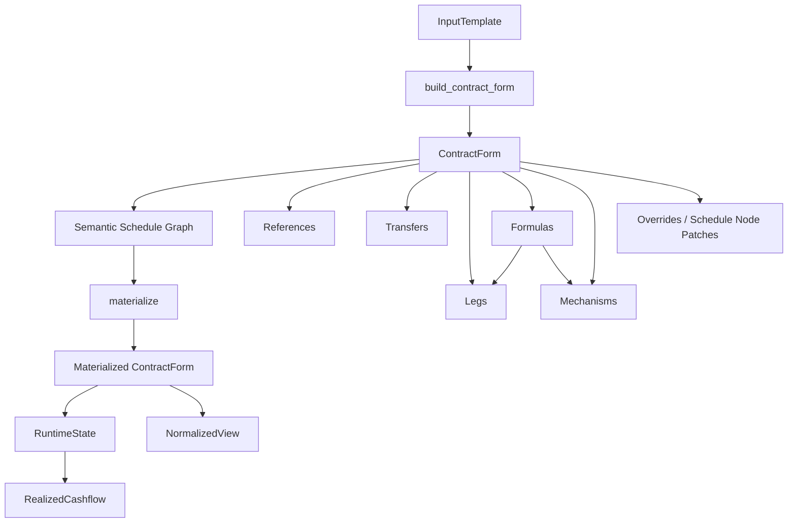
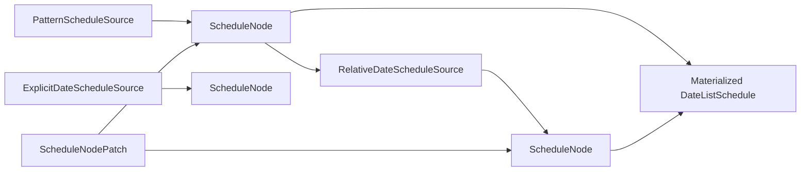
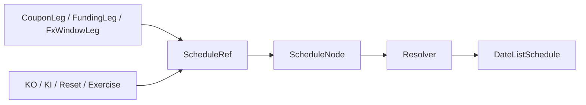

# Form-first Derivative Contract Model
## Semantic Schedule Graph を含む一貫設計版

この文書は、`contract_model_schedule_semantic_graph.py` に実装した  
**Form-first Derivative Contract Model** の詳細設計書である。

原本 README を土台としつつ、今回の版では特に  
**schedule を first-class な意味付きノードとして扱う設計** を正式に組み込んでいる。  
つまり、単に

- 契約形態を第一情報として保持する
- 比較・共通処理・状態遷移を扱えるようにする

だけでなく、さらに

- **契約書に書かれる日付の意味そのものを型として持つ**
- **schedule 間依存を明示的な graph として持つ**
- **複数 role を同じ日付ノードに持てる**
- **patch / override / materialize の責務を分ける**

ところまで含めて、設計を一段 declarative に押し上げた版である。

---

## この README の読み方

この README は長い。  
最初に読むときは、次の順で読むと理解しやすい。

1. **0. この設計が生まれた背景**
2. **1. 設計の結論**
3. **2. 中核思想**
4. **5. Semantic Schedule Graph**
5. **7. オブジェクト同士の依存関係**
6. **8. 実際の商品例**
7. 必要に応じて runtime / normalized / appendix

---

## このモデルで守るべき約束

この README 全体を通じて、次の原則を守る。

### 原則1
**Source of Truth は ContractForm である。**

### 原則2
**InputTemplate は入口であって原本ではない。**

### 原則3
**NormalizedView は派生表現であって原本ではない。**

### 原則4
**schedule の determination structure は契約内容の一部として保持する。**

### 原則5
**schedule の concrete date list は materialized artifact として再生成する。**

### 原則6
**一般則は rule、個別日付例外は patch、値の個別例外は override で持つ。**

### 原則7
**Mechanism は payout の一種ではなく、契約の動き方を表す。**

### 原則8
**same economics でも異なる contract form は潰さずに残す。**

### 原則9
**KO の効力スコープは、できるだけ component 分割で表す。**

---

## 0. この設計が生まれた背景

この設計は、単に「デリバティブを Python のクラスで表したい」という話から始まったわけではない。  
背景には、次のような問題意識があった。

### 0.1 最初の問題意識

やりたかったことは、広い意味での **金融契約の表現方法** を作ることである。  
とくに重視していたのは、次のような点だった。

- 契約内容を **宣言的** に持ちたい
- 典型商品だけでなく、**仕組商品や例外条項** も扱いたい
- あとから契約を **編集・修正** しやすくしたい
- 契約形態としての違いを消さずに残したい
- ただし、必要なら異なる商品同士を **共通して比較・処理** もしたい

つまり、単なるプライシング用 payoff object では足りず、逆に単なる termsheet 的 JSON でも足りない、という立場である。

### 0.2 ACTUS / FpML / CDM をどう見るか

議論の途中で、ACTUS / FpML / CDM の役割の違いを整理した。

- **ACTUS** は、契約条件から cashflow / state transition を生成する、かなり **計算寄り** の標準
- **FpML** は、商品ごとの契約条件やメッセージ交換に強い、かなり **form / exchange 寄り** の標準
- **CDM** は、経済的意味や lifecycle event を共通化する、かなり **meaning / state transition 寄り** のモデル

ここから見えてきたのは、次の事実だった。

1. 契約管理の主表現を ACTUS にするのは重い
2. FpML の発想は **契約形態を残す** 点で有用
3. CDM の発想は **共通比較・共通処理・状態遷移** に有用
4. しかし CDM をそのまま source of truth にすると、元の入力意図や契約形態がぼやけやすい

### 0.3 「テンプレート」について再定義が必要になった

途中で「テンプレート」という言葉を使っていたが、議論を進めるうちに、それが少なくとも 2 種類あることが分かった。

#### A. 入力テンプレート
ユーザーが少数の代表パラメータだけを入れるためのもの。

#### B. 契約テンプレート / Product Grammar
商品種別ごとに、使える

- payout
- rule
- mechanism
- schedule structure
- patch / override

の組み合わせを制限した、正式な authoring schema。

そして本当に source of truth になるべきなのは、後者に近いものだった。  
単なる入力フォームではなく、**編集可能で、例外も受け止められる product grammar** が必要だった。

### 0.4 「スケジュール + ペイオフ + KO」では足りなかった

最初の直観として、商品は

- スケジュール
- ペイオフのルール
- KO ルール

に分解できるのではないか、という考え方があった。  
しかし Snowball / TARF / MtM notional swap / FX option package を考えると、これだけでは不十分だった。

不足していたのは主に次である。

- **観測**: 何を、いつ、どう見るか
- **状態**: 過去の観測を踏まえた途中経過
- **状態遷移機構**: KO / KI / coupon memory / target accumulation / notional reset
- **イベント**: 実際に何が起きたか
- **schedule dependency**: payment を基準に fixing や observation が決まる構造
- **個別例外**: 第 5 回だけ変更、特定日だけずらす等

### 0.5 schedule の設計が大きな論点になった

議論を進めるうちに、schedule について次の認識に至った。

1. 人間は契約を  
   - payment は quarterly  
   - fixing は payment の 2 business days prior  
   - observation は payment の 5 business days prior  
   のように説明する
2. これは単なる入力補助ではなく、**契約書そのものに書かれることが多い**
3. したがって、schedule の依存関係は契約内容として保持する価値がある
4. しかし、単なる `"payment_schedule"` のような string 参照では弱い
5. さらに、同じ日が  
   - payment でもあり  
   - fixing でもあり  
   - observation でもある  
   ようなことも普通に起きる

この結果、schedule は

- arbitrary な名前付き DAG
ではなく、
- **意味付き schedule node と、その関係**
として表した方が自然だ、という結論に至った。

### 0.6 最終的に整理された要件

#### 契約表現として必要なこと
- 契約形態を第一情報として保持する
- 同じ経済効果でも、別 form として保持できる
- schedule / step / override / irregular condition を正式サポートする
- product grammar として、商品ごとの許容構成を表せる
- **schedule の determination structure を契約内容として保持できる**
- **その日付が何を意味するかを first-class に表現できる**

#### ユーザー入力として必要なこと
- 入力はなるべく少数パラメータで済ませたい
- ただし入力時点で **どの契約形態として起こすか** は指定したい
- 入力から正式な ContractForm への変換は **一意** にしたい

#### 共通処理として必要なこと
- 異なる商品形態でも、必要なら normalized な比較ができる
- runtime state を持つ商品を扱える
- MtM reset のような **観測に応じた将来パラメータ更新** を扱える
- FX option のように **form 上のラベルと意味表現を分ける** 必要があるものを扱える

#### 実装アーキテクチャとして必要なこと
- InputTemplate / ContractForm / RuntimeState / NormalizedView を分離する
- payout primitive だけではなく、mechanism を導入する
- source of truth は normalized view ではなく ContractForm に置く
- schedule は determination structure と materialized result を分ける
- direct object cycle は避け、ID 参照 + resolver にする

この README の残りは、その要件に対してどのような設計を採ったかを説明する。

---

## 1. 設計の結論

このモデルは、金融契約を次の 4 層で扱う。

1. **InputTemplate**  
   少数の代表パラメータを受ける、ユーザー向け入力層
2. **ContractForm**  
   契約形態を保ったまま永続化・編集する、source of truth
3. **RuntimeState**  
   観測・イベント処理の途中経過を保持する動的状態層
4. **NormalizedView**  
   異なる契約形態を横断して比較・検索・集計する派生ビュー

ただしこの版では、`ContractForm` の内部で schedule をさらに

- **semantic schedule graph**
- **materialized date lists**

に分けて考える。

つまり全体像は実質的にこうなる。

- InputTemplate
- ContractForm
  - parties / references / transfers / legs / formulas / mechanisms
  - semantic schedule graph
  - patches / overrides
- materialized ContractForm
- RuntimeState
- NormalizedView

---

## 2. 中核思想

### 2.1 ContractForm が原本

この設計では、永続化と編集の中心は `ContractForm` である。

`ContractForm` は次を持つ。

- `form_id`, `form_kind`
- `parties`
- `party_roles`
- `references`
- `transfers`
- `legs`
- `formulas`
- `mechanisms`
- `overrides`
- `schedule_patches`
- `schedule_nodes`
- `schedule_node_patches`
- `tags`

重要なのは、**normalized view を原本にしない** ことである。  
Forward と Synthetic Forward が同じような経済効果を持っていても、原本では別 form として残す。  
FX option の `CALL/PUT` と exchange-right も同様である。

### 2.2 InputTemplate は入口であって原本ではない

InputTemplate は、ユーザーが

- underlier
- strike
- notional
- maturity
- product kind
- realization

のような代表パラメータだけで商品を起こせるようにするための層である。

ただし、InputTemplate だけでは

- 例外条項
- 局所修正
- schedule dependency
- product-specific editing

を十分に保持できない。  
したがって、InputTemplate はあくまで **入口** であり、source of truth は ContractForm である。

### 2.3 Mechanism は「仕組み」を表す

Leg を増やしていくだけでは、Snowball や Autocallable のような商品で型が爆発しやすい。  
そこで、

- **Leg** は基礎となる経済流
- **Mechanism** は条件分岐・状態更新・活性/非活性を制御する仕組み

として分けた。

### 2.4 RuntimeState は条項とは別に持つ

Snowball / TARF / MtM notional swap のような商品では、将来 cashflow を決めるために途中経過が必要である。

例:

- `knocked_out`
- `knocked_in`
- `autocalled`
- `accumulated_target_amount`
- `memory_coupon_balance`
- `current_notional_pay_leg`

これらは契約条項そのものではなく、**契約条項を時系列で適用した途中経過** である。  
よって `RuntimeState` として別建てにしている。

### 2.5 schedule の determination structure も契約内容である

この版で特に重要なのはここである。

契約書に

- payment dates are quarterly
- each fixing date is two business days prior to the related payment date
- subject to business day convention X
- except the fifth payment date shall be ...

のように書くなら、schedule の依存関係は単なる入力補助ではない。  
それは **契約内容の一部** である。

したがって、

- resolved schedule だけを本体にする
のではなく、
- **schedule determination structure** も保持する

必要がある。

### 2.6 ただし runtime / timeline では materialized schedule を使う

一方で、runtime や event processing に必要なのは concrete date list である。  
そこで、

- contract substance としての semantic schedule graph
- operational artifact としての materialized schedule

を分ける。

つまり、ContractForm に対して `materialize()` を行い、  
各 component が参照する schedule を `DateListSchedule` に展開したあとで runtime に渡す。

### 2.7 一般則は rule、個別日付例外は patch、値例外は override

- **一般則**  
  quarterly payment, fixing = payment - 2bd  
  → schedule node source / relation
- **日付の個別例外**  
  第 5 回 payment だけずらす  
  → schedule node patch
- **値の個別例外**  
  第 3 回 coupon だけ 12%  
  → `CashflowOverride`

### 2.8 KO の効力スコープは component 分割で表す

KO の trigger は mechanism に持たせるが、  
KO の効力がどこに及ぶかは、できるだけ **component の切り方** で表す。

たとえば、

- 5回目以降だけ KO 対象
- 奇数回だけ KO 対象

のような条件は、まず

- `coupon_leg_first_4`
- `coupon_leg_post_4`
- `coupon_leg_odd`
- `coupon_leg_even`

のように **leg を分割** して表現する。

---

## 3. 商品テンプレートの役割と考え方

### 3.1 本モデルにおける「テンプレート」の意味

この設計では、「テンプレート」という言葉を次の 2 段で使う。

#### 入力テンプレート (`InputTemplate`)
ユーザーが少数パラメータだけを指定するためのもの。

例:
- `ForwardInputTemplate`
- `SyntheticForwardInputTemplate`
- `VanillaOptionInputTemplate`
- `FxOptionInputTemplate`
- `SnowballInputTemplate`
- `TarfInputTemplate`
- `MtMNotionalSwapInputTemplate`

#### 契約テンプレート / Product Grammar
ある商品種別で使える

- reference
- leg
- formula
- mechanism
- semantic schedule node
- patch / override

の組み合わせ方を制限する schema のこと。

### 3.2 テンプレートが担う役割

テンプレートの役割は、単なる UI 用入力フォームではない。  
主に次の役割を持つ。

1. **product kind の明示**
2. **契約形態の選択**
3. **default 値の補完**
4. **typical structure の生成**
5. **一意な ContractForm への変換**

### 3.3 なぜ入力テンプレートからの変換は一意か

このモデルでは、

- InputTemplate → ContractForm は **一意**
- ContractForm → NormalizedView は **多対一あり**

という立場を取る。

### 3.4 真面目なテンプレートが必要な理由

契約を source of truth として持つ以上、テンプレートは最低でも次を正式に扱えないといけない。

- schedule
- parameter step
- local override
- observation rule
- conditional clause
- stateful mechanism
- schedule determination structure
- schedule patch

この意味で、テンプレートはかなり真面目な product grammar であり、単なる dict では足りない。

---

## 4. 金融商品の分解方法

本モデルでは、金融商品を次の 10 の観点で分解する。

### 4.1 Identity
- `form_id`
- `form_kind`
- `template_kind`
- version / tag

### 4.2 Parties / Roles
- `PartyRef`
- `PartyRoleAssignment`
- buyer / seller
- payer / receiver
- issuer / holder
- calculation agent など

### 4.3 References
- 単一資産 (`UnderlierRef`)
- バスケット (`BasketRef`)
- FX ペア (`FxPair`)
- 金利 index
- credit reference

### 4.4 Semantic Schedules
- その日付が **何を意味するか**
- どの component / mechanism に属するか
- どの schedule がどれに依存するか

### 4.5 Transfers
- `PremiumTransfer`
- `RedemptionTransfer`
- `FeeTransfer`

### 4.6 Legs
- `SettlementLeg`
- `OptionExerciseLeg`
- `FxOptionExerciseLeg`
- `FxExchangeRightLeg`
- `CouponLeg`
- `FundingLeg`
- `FxWindowLeg`

### 4.7 Formulas / Rules
- `FixedRateFormula`
- `FloatingRateFormula`
- `FxForwardPayoffFormula`
- `MtMNotionalResetFormula`
- `DigitalFormula`
- `CouponMemoryFormula`

### 4.8 Predicates / Conditions
- `ComparisonPredicate`
- `BarrierPredicate`
- `TargetReachedPredicate`

### 4.9 Mechanisms / Stateful behavior
- `KnockOutMechanism`
- `KnockInMechanism`
- `CouponMemoryMechanism`
- `StepUpMechanism`
- `AccumulateUntilTargetMechanism`
- `ExerciseMechanism`
- `AutoCallMechanism`
- `AmortizationMechanism`
- `NotionalResetMechanism`

### 4.10 Runtime State / Events
- `RuntimeState`
- `ObservationRecord`
- `RealizedCashflow`

---

## 5. Semantic Schedule Graph

ここが今回の版の中心である。

### 5.1 なぜ schedule を first-class にするのか

従来の `payment_schedule` のような string 名ベースの依存表現では、

- ドメイン意味が名前に依存する
- typo / rename に弱い
- 依存関係の追跡が弱い
- 同じ日が複数の意味を持つことを表しにくい

という問題がある。

そこで今回は、schedule を

- **意味付きノード**
- **ノード間関係**
- **patch**
- **materialization**

として first-class にした。

### 5.2 `DateRole`

`DateRole` は、その日付が何を意味するかを表す。

例:
- `PAYMENT`
- `FIXING`
- `OBSERVATION`
- `EXERCISE`
- `SETTLEMENT`
- `RESET`
- `PRINCIPAL_EXCHANGE`
- `ACCRUAL_START`
- `ACCRUAL_END`
- `CUSTOM`

### 5.3 role は単数ではなく複数集合

1つの日付が複数の意味を持つことは普通にある。  
たとえば、同じ日が

- payment でもあり
- fixing でもある

ことがある。

そこで、このモデルでは role を単数ではなく

- `frozenset[DateRole]`

として持てるようにしている。

つまり、

- **Payment かつ Fixing**
- **Observation かつ Determination**

のような状態を自然に表せる。

### 5.4 `ScheduleOwner`

日付の意味は、それだけでは不十分で、  
**誰の / 何の日付か** も必要である。

たとえば

- coupon leg の payment date
- KO mechanism の observation date
- MtM reset mechanism の reset date

は、role が同じでも owner が違う。

そこで `ScheduleOwner` は、

- owner type
- owner id

を持ち、その schedule meaning がどの component / mechanism / form に属するかを表す。

### 5.5 `ScheduleMeaning`

`ScheduleMeaning` は

- `roles: frozenset[DateRole]`
- `owner: ScheduleOwner`
- `custom_labels`

を持つ。

これにより、

- このノードは coupon leg の PAYMENT
- このノードは coupon leg の PAYMENT + FIXING
- このノードは KO mechanism の OBSERVATION

のように、**ドメイン意味を first-class に表現** できる。

### 5.6 `ScheduleNodeId`, `ScheduleRef`, `ScheduleNode`

#### `ScheduleNodeId`
ノードを識別する ID。  
ただし意味は ID ではなく `ScheduleMeaning` にある。

#### `ScheduleRef`
component 側が持つ lightweight な参照。  
component は node 実体を直接持たず、`ScheduleRef` だけを持つ。

#### `ScheduleNode`
schedule graph のノード本体。

- `node_id`
- `meaning`
- `source`
- `description`

を持つ。

ここで重要なのは、

- `ContractForm` が node を所有する
- component は `ScheduleRef` で参照する
- node は component を参照しない

という一方向依存にしていることだ。

これにより、**direct object cycle を避けている**。

### 5.7 schedule source

ノードの source は大きく3種類ある。

#### `PatternScheduleSource`
周期パターンで生成する root schedule。

#### `ExplicitDateScheduleSource`
明示的な date list を source とする。

#### `RelativeDateScheduleSource`
他ノードから offset で導く derived schedule。

### 5.8 patch

ノードに対する個別日付修正は patch として持つ。

#### `ScheduleNodeDatePatch`
元の日付を指定して置換する。

#### `ScheduleNodeIndexPatch`
第何回目かを指定して置換する。

### 5.9 materialize

semantic schedule graph をそのまま runtime で使うわけではない。  
runtime / event processing / timeline では、resolved な `DateListSchedule` が欲しい。

そこで `ContractForm.materialize()` は、

1. schedule node graph を resolver でたどる
2. dependency を解決する
3. patch を適用する
4. component が持つ `ScheduleRef` を concrete `DateListSchedule` に置き換える

という処理を行う。

### 5.10 cycle はどう避けるか

schedule node が互いを直接実体参照すると危ないが、この設計では

- node 間も ID 参照
- component も `ScheduleRef`
- resolver が graph をたどる

ので direct object cycle は避けている。

一方で、意味上の依存循環は resolver が **DAG 制約** として検出するべき対象である。

---

## 6. 主要オブジェクトの役割

### 6.1 Reference

#### `UnderlierRef`
単一の参照対象を表す。

```python
UnderlierRef("USDJPY", "FX")
UnderlierRef("SOFR", "IR")
UnderlierRef("NKY", "EQ")
```

### 6.2 `FxPair`

FX option で base / quote を明示的に持つ。

```python
FxPair(Currency.USD, Currency.JPY)
```

### 6.3 `SteppedDecimal` / `CashflowOverride`

#### `SteppedDecimal`
時間とともに値が step するパラメータ。

#### `CashflowOverride`
個別期だけ例外的に値を上書きする。

### 6.4 Formula

formula は leg や mechanism が参照する算定式である。  
基本的な使い方は `FormulaBinding(name, formula)` として `ContractForm` に登録し、leg / mechanism 側が `name` を参照する。

### 6.5 Predicate

predicate は trigger / branch condition を表す。  
Barrier や target 到達を独立のオブジェクトとして持つ。

### 6.6 Transfer

transfer は単独の支払いを表す。

- premium
- redemption
- fee
- principal exchange

### 6.7 Leg

leg は反復的または構造的な経済流を表す。

#### `FxOptionExerciseLeg`
FX option の form-facing な表現。

- `pair`
- `option_type`
- `base_notional`
- `strike`

を持つ。  
`CALL/PUT` は **base currency に対する call/put** と定義する。

#### `FxExchangeRightLeg`
FX option の meaning 表現。

- receive currency / amount
- pay currency / amount

を直接持つ。

### 6.8 Mechanism

mechanism は「仕組み」を表す。

特にこの版では、

- KO / KI / TARGET / reset

を **状態更新・活性制御のモジュール** として明確に扱う。

### 6.9 RuntimeState

`RuntimeState` は次のような値を保持する。

- `flags`
- `numeric_state`
- `active_component_ids`
- `observations`
- `realized_cashflows`

### 6.10 NormalizedView

`NormalizedView` は ContractForm から派生的に作る比較用ビューである。  
source of truth ではない。

---

## 7. オブジェクト同士の依存関係

### 7.1 全体の依存関係



### 7.2 Schedule graph の依存関係



### 7.3 component と schedule の関係



### 7.4 依存方向の原則

依存は概ね次の向きにする。

- InputTemplate → ContractForm
- ContractForm → RuntimeState / NormalizedView
- ContractForm → ScheduleNode
- component → ScheduleRef
- resolver → ScheduleNode graph を解決
- materialized form → runtime に渡す

逆に、

- component が ScheduleNode 実体を直接持つ
- ScheduleNode が component を直接参照する
- ContractForm が NormalizedView に依存する

という方向は採らない。

---

## 8. 実際の商品例 16 個

以下では、これまでの議論で出てきたものに、FX option と schedule graph の論点も含めて 16 商品の表現例を載せる。  
コードは README 用に簡潔化しているが、基本的なオブジェクト対応が見えるようにしている。

### 共通 import

```python
from datetime import date
from decimal import Decimal

from contract_model_schedule_semantic_graph import *
```

### 8.1 Outright Forward

```python
usd_jpy = UnderlierRef("USDJPY", "FX")

form = build_contract_form(
    ForwardInputTemplate(
        realization="OUTRIGHT",
        underlier=usd_jpy,
        side=Side.BUY,
        quantity=Decimal("1000000"),
        strike=Decimal("150.25"),
        expiry_date=date(2026, 12, 20),
        settlement_date=date(2026, 12, 22),
        settlement_style=SettlementStyle.PHYSICAL,
        currency=Currency.JPY,
    )
)
```

### 8.2 Prepaid Forward

```python
form = build_contract_form(
    ForwardInputTemplate(
        realization="PREPAID",
        underlier=usd_jpy,
        side=Side.BUY,
        quantity=Decimal("1000000"),
        strike=Decimal("150.25"),
        expiry_date=date(2026, 1, 20),
        settlement_date=date(2026, 12, 22),
        settlement_style=SettlementStyle.PHYSICAL,
        currency=Currency.JPY,
    )
)
```

### 8.3 Synthetic Forward

```python
form = build_contract_form(
    SyntheticForwardInputTemplate(
        underlier=usd_jpy,
        side=Side.BUY,
        quantity=Decimal("1000000"),
        strike=Decimal("150.25"),
        expiry_date=date(2026, 12, 20),
        premium_currency=Currency.JPY,
        settlement_style=SettlementStyle.CASH,
    )
)
```

### 8.4 Vanilla Call Option

```python
nky = UnderlierRef("NKY", "EQ")

form = build_contract_form(
    VanillaOptionInputTemplate(
        underlier=nky,
        side=Side.BUY,
        option_type=OptionType.CALL,
        quantity=Decimal("1000"),
        strike=Decimal("42000"),
        expiry_date=date(2026, 12, 18),
        premium=Money(Decimal("850000"), Currency.JPY),
        premium_payment_date=date(2026, 1, 20),
        settlement_style=SettlementStyle.CASH,
    )
)
```

### 8.5 Vanilla Put Option

```python
form = build_contract_form(
    VanillaOptionInputTemplate(
        underlier=nky,
        side=Side.BUY,
        option_type=OptionType.PUT,
        quantity=Decimal("1000"),
        strike=Decimal("38000"),
        expiry_date=date(2026, 12, 18),
        premium=Money(Decimal("620000"), Currency.JPY),
        premium_payment_date=date(2026, 1, 20),
        settlement_style=SettlementStyle.CASH,
    )
)
```

### 8.6 FX Option (USD Call / JPY Put)

```python
fx_tpl = FxOptionInputTemplate(
    pair=FxPair(Currency.USD, Currency.JPY),
    side=Side.BUY,
    option_type=OptionType.CALL,
    base_notional=Decimal("1000000"),
    strike=Decimal("150.25"),
    expiry_date=date(2026, 12, 18),
    settlement_style=SettlementStyle.PHYSICAL,
)
form = build_contract_form(fx_tpl)
fx_leg = form.legs[0]
exchange_leg = fx_option_to_exchange_right(fx_leg)
```

### 8.7 Zero-Coupon Fixed Note

```python
usd = UnderlierRef("USD", "OTHER")

form = ContractForm(
    form_id="FORM-ZC-NOTE",
    form_kind="ZERO_COUPON_NOTE",
    parties=(PartyRef("ISSUER", "Dealer"), PartyRef("HOLDER", "Client")),
    party_roles=(
        PartyRoleAssignment("issuer", "ISSUER"),
        PartyRoleAssignment("holder", "HOLDER"),
    ),
    references=(usd,),
    transfers=(
        RedemptionTransfer(
            component_id="redemption",
            payer_party_id="ISSUER",
            receiver_party_id="HOLDER",
            amount=Money(Decimal("10500000"), Currency.USD),
            payment_date=date(2028, 12, 29),
        ),
    ),
    legs=(),
    formulas=(),
    mechanisms=(),
)
```

### 8.8 Fixed vs Floating Interest Rate Swap

```python
sofr = UnderlierRef("SOFR", "IR")
schedule = DateListSchedule((
    date(2026, 6, 30), date(2026, 12, 31), date(2027, 6, 30)
))
```

`FundingLeg + FixedRateFormula` と `FundingLeg + FloatingRateFormula` の組み合わせで表す。

### 8.9 Basis Swap

両脚とも `FundingLeg + FloatingRateFormula` で表し、違いは index / spread / currency に置く。

### 8.10 Cash-or-Nothing Digital Option

`DigitalFormula` を使い、cash settlement amount を `CouponLeg` 的に持つ。

### 8.11 Barrier Knock-In Put

`OptionExerciseLeg + KnockInMechanism + BarrierPredicate + ExerciseMechanism` の組み合わせで表す。

### 8.12 Range Accrual Note with Knock-Out

`CouponLeg + FloatingRateFormula + KnockOutMechanism` の組み合わせで表す。

### 8.13 Autocallable Note

`CouponLeg + AutoCallMechanism + RedemptionTransfer` の組み合わせで表す。

### 8.14 Snowball with Memory / Step-Up / KO

```python
snowball = build_contract_form(
    SnowballInputTemplate(
        underlier=nky,
        notional=Decimal("10000000"),
        currency=Currency.JPY,
        coupon_schedule=DateListSchedule((
            date(2026, 3, 31), date(2026, 6, 30), date(2026, 9, 30), date(2026, 12, 31)
        )),
        observation_schedule=DateListSchedule((
            date(2026, 3, 30), date(2026, 6, 29), date(2026, 9, 29), date(2026, 12, 30)
        )),
        base_coupon_rate=Decimal("0.10"),
        knock_out_barrier=Decimal("43000"),
        coupon_memory=True,
        step_up_coupon_rate=Decimal("0.12"),
        knock_out_redemption_amount=Decimal("10000000"),
    )
)
```

### 8.15 TARF

```python
tarf = build_contract_form(
    TarfInputTemplate(
        currency_pair=usd_jpy,
        buy_amount=Decimal("1000000"),
        strike=Decimal("150.00"),
        fixing_schedule=DateListSchedule((
            date(2026, 2, 27), date(2026, 3, 31), date(2026, 4, 30), date(2026, 5, 29)
        )),
        payment_schedule=DateListSchedule((
            date(2026, 3, 2), date(2026, 4, 1), date(2026, 5, 1), date(2026, 6, 1)
        )),
        settlement_currency=Currency.JPY,
        target_amount=Decimal("20000000"),
        accumulation_currency=Currency.JPY,
        leverage_above_strike=Decimal("2.0"),
        leverage_below_strike=Decimal("1.0"),
        terminate_on_target=True,
    )
)
```

### 8.16 MtM Notional Cross-Currency Swap

```python
mtm_ccs = build_contract_form(
    MtMNotionalSwapInputTemplate(
        fx_reference=usd_jpy,
        pay_currency=Currency.JPY,
        receive_currency=Currency.USD,
        pay_initial_notional=Decimal("150000000"),
        receive_initial_notional=Decimal("1000000"),
        base_fx=Decimal("150.00"),
        effective_date=date(2026, 1, 5),
        maturity_date=date(2028, 1, 5),
        coupon_schedule=DateListSchedule((
            date(2026, 7, 5), date(2027, 1, 5), date(2027, 7, 5), date(2028, 1, 5)
        )),
        reset_schedule=DateListSchedule((
            date(2026, 7, 1), date(2027, 1, 1), date(2027, 7, 1)
        )),
        principal_exchange_mode=PrincipalExchangeMode.INITIAL_AND_FINAL,
        principal_exchange_schedule=DateListSchedule((date(2026, 1, 5), date(2028, 1, 5))),
        final_exchange_notional_source=FinalExchangeNotionalSource.CURRENT,
        pay_rate_formula=FloatingRateFormula("TONA", SteppedDecimal(Decimal("0.0010"))),
        receive_rate_formula=FloatingRateFormula("SOFR", SteppedDecimal(Decimal("0.0015"))),
        reset_target_leg_ids=("pay_leg",),
        reset_target_state_keys=("current_notional_pay_leg",),
        scale_direction="DIRECT",
        rounding_digits=0,
    )
)
```

---

## 9. 例を通して見える設計ルール

### 9.1 契約形態は `form_kind` で明示する

- `FORWARD_OUTRIGHT`
- `FORWARD_PREPAID`
- `FORWARD_SYNTHETIC`
- `VANILLA_CALL_BUY`
- `FX_OPTION_OUTRIGHT`
- `SNOWBALL`
- `TARF`
- `MTM_XCCY_SWAP`

### 9.2 反復する経済流は leg に置く

- coupon
- funding
- FX fixing-based payoff
- option exercise right
- settlement flow

### 9.3 単独の支払は transfer に置く

- premium
- fee
- redemption
- principal exchange

### 9.4 状態依存の契約挙動は mechanism に置く

- KO / KI
- exercise
- autocall
- target accumulation
- coupon memory
- step-up
- notional reset

### 9.5 schedule dependency は semantic schedule graph に置く

- payment
- fixing
- observation
- reset
- settlement
- principal exchange

の determination structure を graph として持つ。

### 9.6 一時点の途中経過は RuntimeState に置く

- knocked_out?
- exercised?
- accumulated target?
- current notional?
- active components?

### 9.7 共通比較は NormalizedView に任せる

source of truth ではなく、比較・検索・集計のための派生に留める。

---

## 10. この設計でカバーしやすいもの / 今後の拡張点

### 10.1 今の枠組みでかなり表しやすいもの

- forwards / prepaid forwards / synthetic forwards
- vanilla options
- FX options
- coupon notes
- IRS / basis swap / CCS
- autocallable / snowball
- TARF / target accumulation products
- MtM notional products
- schedule dependency を持つ契約

### 10.2 追加実装するとさらに強くなるもの

- barrier option 専用の richer realization
- CDS / CLN 用 protection leg
- Bermudan / American exercise の richer handling
- business day calendar の本格実装
- day count の厳密計算
- richer period schedule
- serialization / schema export

### 10.3 この設計の限界

このモデルは、**契約表現の見通しを重視した form-first な基盤** である。  
完全な valuation library でもなければ、完全な legal clause DSL でもない。  
したがって、以下はアプリケーション層で補うのが自然である。

- 市場データの取得
- predicate / formula の実評価器
- legal document round-trip
- full calendar engine

---

## 11. 実務上の使い方の勧め

### 推奨ワークフロー

1. ユーザーは `InputTemplate` に少数パラメータを入力
2. `build_contract_form(...)` で ContractForm を生成
3. 必要に応じて schedule node graph を追加・編集
4. ContractForm を source of truth として永続化
5. `materialize()` で concrete schedule に展開
6. 観測イベントに応じて RuntimeState を更新
7. 比較・検索・集計時だけ NormalizedView を再計算

### 設計上の原則

- 原本は ContractForm
- 入力は InputTemplate
- 動的状態は RuntimeState
- 共通比較は NormalizedView
- 条件・状態遷移は Mechanism
- schedule の determination structure は semantic schedule graph

---

## 12. まとめ

このモデルが解決しようとしているのは、単に「デリバティブのクラス定義」ではない。  
本当に解決したいのは、次の両立である。

- **契約形態を保ったまま、編集・保存できること**
- **異なる商品を共通比較・共通処理できること**
- **契約書に書かれる schedule determination structure を保持できること**
- **同じ日付が持つ複数の意味を first-class に表現できること**

そのために、

- InputTemplate
- ContractForm
- RuntimeState
- NormalizedView

の 4 層を分け、さらに ContractForm の内部を

- references
- transfers
- legs
- formulas
- predicates
- mechanisms
- overrides
- semantic schedule graph

に分解した。

そして、Snowball / TARF / MtM notional swap / FX option / semantic schedule graph の議論を通して、  
**金融商品は「スケジュール + ペイオフ」だけでなく、「状態を伴う仕組み」として捉える必要があり、schedule もまた意味を伴う契約構造として扱うべきである**
という結論に至った。

この README は、その到達点を文書化したものである。

---

## 13. 関連ドキュメント

- `APPENDIX_semantic_schedule_graph_examples.md`
- `LEARNING_PATH_updated_for_fx.md`
- `SCHEDULE_RULE_LEARNING_TASKS.md`
- `PATCH_OVERRIDE_LEARNING_TASKS.md`

実装本体:
- `contract_model_schedule_semantic_graph.py`

# README 追補: `AccrualCouponLeg` 導入後の Coupon / Coupon Swap の扱い

この文書は、`contract_model_schedule_semantic_graph_accrual_coupon.py` において  
`AccrualCouponLeg` を導入したことに伴う **README 追補** である。

目的は次の 3 点である。

1. なぜ `CouponLeg` だけでは Coupon Swap の中心表現として弱いのかを明確にする
2. `AccrualCouponLeg` を導入する理由を整理する
3. Coupon / Coupon Swap をどう使い分けるかを README レベルで明文化する

---

# 1. 結論

この版では、coupon 系の leg を次の 2 段に分けて考える。

## 1.1 `CouponLeg`
簡易版の coupon stream を表す。

向いているもの:

- 学習用の最小例
- 単純な coupon payment stream
- accrual period をあえて省略しても問題が小さいケース
- note 的な簡易 coupon の表現

## 1.2 `AccrualCouponLeg`
**本格的な coupon determination を伴う coupon leg** を表す。

向いているもの:

- Coupon Swap
- IRS
- Basis Swap
- Floating coupon note
- Coupon fixing / accrual period / day count を明示したい商品
- 각期 coupon が fixing / accrual period から決まる商品

---

# 2. なぜ `CouponLeg` だけでは不十分か

従来の `CouponLeg` は、概念的には

- payment schedule
- notional
- rate formula
- currency
- day count

だけを持つ簡易 leg である。

これは「coupon stream の最小表現」としては役に立つが、  
Coupon Swap をきちんと表すには不足がある。

## 2.1 accrual period が見えない
クーポンは通常、各期ごとに

```text
coupon amount
= notional × rate × accrual factor
```

で決まる。

そのためには少なくとも

- accrual start
- accrual end

が必要である。

`CouponLeg` が payment date しか持たないと、  
「何の期間の利息か」が leg の構造として表れない。

## 2.2 fixing と coupon determination の対応が弱い
floating coupon や structured coupon では、各期の coupon rate は

- fixing
- accrual period
- formula

の組み合わせで決まる。

`CouponLeg` が payment schedule だけを持つと、  
「各 coupon が個別に決まる」ことが leg の構造から読み取りにくい。

## 2.3 Coupon Swap は少なくとも 2-leg 構造が自然
Coupon Swap を自然に表すなら、通常は

- pay coupon leg
- receive coupon leg

の 2 本が必要である。

その各 leg に対して

- payment
- fixing
- accrual start
- accrual end

を持つ方が、契約条項との対応が見やすい。

---

# 3. `AccrualCouponLeg`

そこで、この版では `AccrualCouponLeg` を導入する。

## 3.1 概要

`AccrualCouponLeg` は、coupon determination に必要な schedule を leg 自体が持つ。

概念的には次のような構造である。

```python
@dataclass(frozen=True)
class AccrualCouponLeg(Leg):
    component_id: str
    payer_party_id: str
    receiver_party_id: str
    reference: ReferenceRef
    notional: SteppedDecimal

    payment_schedule: ScheduleRefLike
    accrual_start_schedule: ScheduleRefLike
    accrual_end_schedule: ScheduleRefLike
    fixing_schedule: Optional[ScheduleRefLike] = None

    rate_formula_name: str
    currency: Currency
    day_count: DayCount
```

## 3.2 何が leg に入るのか

### 必須
- `payment_schedule`
- `accrual_start_schedule`
- `accrual_end_schedule`
- `rate_formula_name`
- `notional`
- `currency`
- `day_count`

### 任意
- `fixing_schedule`

これは、fixed coupon では fixing が不要なことがあるためである。

## 3.3 semantic schedule graph との対応

`AccrualCouponLeg` を使うとき、semantic schedule graph 側では通常その leg に対して

- `PAYMENT`
- `FIXING`
- `ACCRUAL_START`
- `ACCRUAL_END`

の meaning を持つ node を用意するのが自然である。

つまり、

- leg 側は schedule ref を持つ
- graph 側はその schedule の意味を持つ

という対応になる。

---

# 4. `CouponLeg` と `AccrualCouponLeg` の使い分け

## 4.1 `CouponLeg` を使う場面

### 向いているケース
- 最小例を示したいとき
- coupon stream の概念だけ見せたいとき
- note 的に payment stream を簡易に持ちたいとき
- accrual period を別途省略しても十分な説明になるとき

### 向いていないケース
- Coupon Swap
- IRS
- floating coupon determination が中心の契約
- accrual factor を契約構造として見せたいとき

## 4.2 `AccrualCouponLeg` を使う場面

### 向いているケース
- Coupon Swap
- Interest Rate Swap
- Basis Swap
- Floating note
- Structured coupon note
- fixing / accrual / payment を分けたい商品

---

# 5. Coupon Swap は今後どう書くべきか

Coupon Swap の中心 leg は、今後は **`AccrualCouponLeg` を使う** のが自然である。

最低限、各 leg に対して次を持たせる。

- payment
- accrual start
- accrual end
- fixing（必要なら）

そして formula は

- fixed rate
- floating rate
- digital coupon
- ratio-forward-like coupon

など product に応じて差し替える。

---

# 6. Coupon Swap の自然な最小構造

Coupon Swap を semantic schedule graph 版で最低限自然に書くなら、次の構造を推奨する。

## pay leg
- `AccrualCouponLeg("pay_coupon_leg")`
- `PAYMENT of pay_coupon_leg`
- `ACCRUAL_START of pay_coupon_leg`
- `ACCRUAL_END of pay_coupon_leg`
- `FIXING of pay_coupon_leg`（必要なら）

## receive leg
- `AccrualCouponLeg("receive_coupon_leg")`
- `PAYMENT of receive_coupon_leg`
- `ACCRUAL_START of receive_coupon_leg`
- `ACCRUAL_END of receive_coupon_leg`
- `FIXING of receive_coupon_leg`（必要なら）

## formulas
- pay leg formula
- receive leg formula

## mechanisms
- KO / KI / target / memory など必要に応じて追加

---

# 7. KO を付ける場合の考え方

Coupon Swap に KO を付ける場合も、今後は `AccrualCouponLeg` を前提に考えた方がよい。

たとえば

- receive leg のみ KO 対象
- 5 回目以降だけ KO 対象
- odd coupons のみ KO 対象

などは、

- `AccrualCouponLeg` を複数本に分割し
- `KnockOutMechanism` は deactivation だけ担当する

のが自然である。

つまり、ここでも

- trigger → mechanism
- effect scope → component 分割

の原則は変わらない。

---

# 8. `materialize()` と `AccrualCouponLeg`

`AccrualCouponLeg` を導入したことで、`materialize()` は各 leg について少なくとも次を解決する。

- `payment_schedule`
- `accrual_start_schedule`
- `accrual_end_schedule`
- `fixing_schedule`（存在する場合）

これにより、runtime / timeline / valuation 前処理では、  
semantic schedule graph を意識せず、resolved schedule を直接使える。

---

# 9. まとめ

今回の変更で、coupon 系の設計は次のように整理された。

## `CouponLeg`
- 簡易版
- coupon stream の最小表現
- 学習用 / 簡易 note 用

## `AccrualCouponLeg`
- 本格版
- accrual period を伴う coupon determination の中心表現
- Coupon Swap / IRS / floating coupon の本命

したがって、**Coupon Swap を本気で表すなら `AccrualCouponLeg` を使うべき** である。  
前の README / 回答例ではこの点が弱く、Coupon Swap と coupon stream の区別が曖昧だった。  
この追補は、その点を明示的に修正するためのものである。
