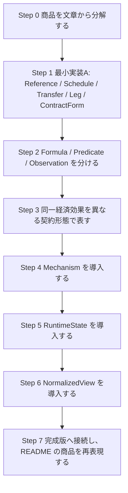

# 学習ガイド: ContractForm / Mechanism / RuntimeState 設計を身につけるための段階的カリキュラム

## このガイドの目的

このガイドは、`contract_model.py` と `README.md` で採用した設計を、
**読むだけでなく自分で使えるようになること** を目的にした学習用ロードマップである。

目標は次の 4 点である。

1. 金融商品を文章から構成要素へ分解できるようになること
2. 構成要素を型・オブジェクトとして表現できるようになること
3. `formula / predicate / mechanism / runtime state` の役割分担を見極められるようになること
4. 未知の商品が来ても、この枠組みにどう乗せるか設計できるようになること

このガイドでは、最初から完成版を覚えようとするのではなく、
**わざと不完全な部分集合から始めて、その限界に当たりながら概念を追加していく**。

その理由は、今回の設計で重要な概念は

- schedule だけでは足りない
- payoff rule を 1 つの塊として持つと破綻する
- KO や TARGET は単なるフラグではなく mechanism として切り出した方がよい
- path dependent な商品には runtime state が必要
- 同じ経済効果でも contract form は複数ありうる

といった点であり、これらは **「困る体験」を通した方が定着しやすい** からである。

---

## このガイドで使う中心的な考え方

### 1. Source of Truth は ContractForm

- ユーザーの編集対象は `ContractForm`
- `NormalizedView` は比較・検索・共通処理のための派生表現
- `RuntimeState` は契約ルールを時系列に適用した途中経過

### 2. ルールは 1 つの箱にまとめない

できるだけ以下に分けて考える。

- `Reference`: 何を見るか
- `Schedule`: いつ見るか / いつ払うか
- `Observation`: どう観測するか
- `Predicate`: 条件判定
- `Formula`: 金額・率の計算
- `Mechanism`: 条件を見て状態や活性/非活性を変える仕組み
- `RuntimeState`: 累積額、KO 済みか、current notional などの途中経過

### 3. form と meaning は分ける

同じ経済効果を持つ契約でも、

- クーポンスワップとして持ちたい
- オプションパッケージとして持ちたい

という区別は、契約上・入力上・編集上は重要である。
したがって、学習でも早い段階から
**「同じ economic meaning を 2 つの contract form で表し分ける」**
ことを扱う。

---

## 学習の全体像

> 重要: 指定の「クーポンスワップ vs オプションパッケージ」は、
> 学習内容の依存関係を崩さない範囲で **できるだけ早い Step 3** に入れている。
> ここで form と meaning を分ける感覚を早期に獲得する。

---

# Step 0: 商品を文章から分解する

## 目的

まだ実装しない。
まず、商品の term sheet 的説明を見て、何が構成要素かを文章で切り出す練習をする。

## この段階で使う観点

各商品について、最低でも次を整理する。

- `Contract Form`
- `References`
- `Schedules`
- `Transfers / Legs`
- `Formulas`
- `Predicates`
- `Mechanisms` が必要か
- `RuntimeState` が必要か
- `NormalizedView` に落としたら何になりそうか

## 推奨題材

- Forward
- Vanilla Call Option
- Fixed Coupon Note
- IRS

## 演習

### 演習 0-1
「この商品の cashflow を決めるために必要な schedule は何個あるか」を書く。

### 演習 0-2
「この商品の payoff を決める formula は何か」を書く。

### 演習 0-3
「この商品には runtime state が必要か。必要なら何を覚えておくべきか」を書く。

### 演習 0-4
「同じ経済効果を別 form で持ちたいとしたら、何が変わり、何が変わらないか」を書く。

## 到達目標

- schedule は 1 個ではないことが自然に見える
- payoff rule を 1 塊で持たない方がよいことが見えてくる
- state が不要な商品と必要な商品の違いを言葉で説明できる

---

# Step 1: 最小実装Aを自力で作る

## 目的

`Mechanism` も `RuntimeState` もまだ入れない。
あえて小さいサブセットだけで表現してみる。

## 実装するもの

- `Reference`
- `DateListSchedule`
- `Transfer`
- `Leg`
- `ContractForm`

この段階では、formula も最小限でよい。
Python ではまず dataclass だけでよい。

## この段階で表せる商品

- Outright Forward
- Vanilla Option
- Fixed Coupon Note
- Fixed/Floating IRS

## 演習

### 演習 1-1
Forward と Vanilla Call を表現する最小 dataclass 群を実装する。

### 演習 1-2
IRS を fixed leg / floating leg の 2 leg で表す。

### 演習 1-3
Prepaid Forward を追加する。

### 演習 1-4
Barrier Option をこの段階の設計で無理やり表そうとしてみる。
そのうえで「何が足りないか」を書く。

## 到達目標

- 静的な商品はかなり表せることが分かる
- しかし barrier や KO を入れると設計が窮屈になることを体感する

---

# Step 2: Formula / Predicate / Observation を分ける

## 目的

「payoff rule」という 1 つの塊を分割する。
この分離は、この後の KO / TARGET / barrier / range accrual を整理する鍵になる。

## 追加するもの

- `Observation`
- `Predicate`
- `Formula`

## 題材

- Digital Option
- Barrier Option
- Range Accrual

## 演習

### 演習 2-1
Digital Option を

- reference
- observation
- predicate
- transfer

に分ける。

### 演習 2-2
Barrier Option で

- vanilla payoff formula
- barrier predicate

を別オブジェクトにする。

### 演習 2-3
Range Accrual で

- observation schedule
- in-range predicate
- coupon formula

を分ける。

## 到達目標

- 「何を見るか」「条件判定」「金額計算」は別責務だと理解できる
- KO rule は特殊物ではなく、predicate と将来活性/非活性の問題だと見えてくる

---

# Step 3: 同一経済効果を異なる契約形態で表す

## 目的

ここで早めに、
**同じ経済効果でも contract form は複数ありうる**
ことを学ぶ。

今回の学習上の中心課題は、

1. **クーポンスワップ** という契約形態
2. **オプションパッケージ** という契約形態

の 2 つで、同じ economic meaning を表し分けることである。

これは、最終設計における

- `ContractForm` を source of truth にする理由
- `NormalizedView` を派生にする理由
- 「form と meaning は別」という考え方

を早く体で理解するために置いている。

---

## この Step の題材: Ratio Forward 形状の FX 商品

ここではペイオフ形状は ratio forward 系にする。
KO 条項としては次を扱う。

- 何もなし
- AKO
- WKO
- TARGET

ここで、ユーザー指定に合わせて 2 つの契約形態で表す。

### 契約形態 A: Coupon Swap

- ペイオフ形状は ratio forward
- payout 的には「digital coupon の受け / 払い」の列として持つ
- KO/TARGET は swap 側の mechanism として持つ

### 契約形態 B: Option Package

- long call + short put の一括契約として持つ
- 必要に応じて各 FX option 自体に EKI を付ける
- 同じ ratio forward 的経済効果を、option package という form で持つ

> このガイドでは、ユーザーの用語に合わせて `EKI` を「European Knock-In」として扱う。FX structured products の資料でも EKI はその意味で使われている。citeturn106199search0turn106199search13

> また、AKO は American Knock-Out、一般的な knock-in / knock-out barrier option は、バリア到達で有効化または失効する path-dependent option の一種である。citeturn106199search0turn106199search1turn106199search4

---

## 学習上の狙い

この Step で学んでほしいのは、

- 同じ payoff shape でも form は違い得る
- form が違うと編集単位・入力意図・法的見え方が違う
- それでも normalized な比較対象としては近い可能性がある
- TARGET や KO は payout の属性ではなく mechanism として持った方がよい

という点である。

---

## 先に制限すること

この Step ではまだ `RuntimeState` を本格導入しない。
したがって、

- TARGET は「mechanism が必要そうだ」と認識するところまで
- AKO / WKO / EKI も「barrier condition + activation/deactivation」を model 化するところまで

でよい。

評価エンジンや時系列 state 更新は Step 5 で本格導入する。

---

## 演習

### 演習 3-1: No-KO 版
同じ ratio forward 系 payoff を、

- Coupon Swap form
- Option Package form

の 2 つで表現する。

書くべきもの:

- 各 form の `ContractForm`
- references
- schedules
- legs / payouts
- formulas
- 両者に共通する normalized meaning の文章説明

### 演習 3-2: AKO 版
Coupon Swap form と Option Package form の両方に AKO を付ける。

考えるべき点:

- barrier predicate はどこに置くか
- KO によりどの component が inactive になるか
- Coupon Swap と Option Package で、KO の見え方がどう違うか

### 演習 3-3: WKO 版
WKO を AKO とは別 variant として model 化する。

ここで重要なのは、
**同じ KO でも monitoring / observation の仕様差が別 component になりうる**
ことを理解することである。

### 演習 3-4: TARGET 版
TARGET を mechanism 候補として書く。
まだ state 実装は不要。

ただし文章で、将来的に必要な state を列挙する。

例:

- accumulated payout
- terminated flag
- termination date

### 演習 3-5: EKI 付き Option Package
Option Package 側で、各 FX option に EKI を付ける。

考えるべき点:

- barrier は package 全体に掛かるのか
- 各 option に個別に掛かるのか
- knock-in 後に option が active になるとはどういうことか

---

## 自力実装の最小スケッチ方針

この Step では、たとえば以下のような最小版でよい。

- `ContractForm`
- `Reference`
- `Schedule`
- `Formula`
- `Predicate`
- `Leg`
- `PackageComponent`

まだ `RuntimeState` は入れず、
`Mechanism` もまずは宣言的な定義だけでよい。

---

## 到達目標

- 同一経済効果を複数 form で表す感覚が身につく
- form と normalized meaning を混同しなくなる
- TARGET / KO / EKI を「将来 mechanism と state が必要なもの」として先取りして理解できる

---

# Step 4: Mechanism を導入する

## 目的

ここで初めて `Mechanism` を明示的に導入する。
まだ `RuntimeState` は軽量でよい。

## 追加するもの

- `KnockOutMechanism`
- `ExerciseMechanism`
- `AccrualMechanism`
- `ActivationMechanism`（必要なら）

## 題材

- Barrier KO Note
- Bermudan Option
- Range Accrual Note
- Step 3 の Coupon Swap / Option Package の KO variants

## 演習

### 演習 4-1
KO を payout 属性として持つ版と、mechanism として持つ版を比較する。

### 演習 4-2
Bermudan Option の exercise を mechanism として表現する。

### 演習 4-3
Range Accrual の accrual を mechanism として表す。

### 演習 4-4
Step 3 で作った AKO / WKO / EKI / TARGET のうち、どれが activation でどれが deactivation か分類する。

## 到達目標

- mechanism は product class ではなく「振る舞いのモジュール」だと理解できる
- KO / KI / TARGET を同じ抽象枠組みで眺められる

---

# Step 5: RuntimeState を導入する

## 目的

ここでようやく path dependent 商品を本格的に扱う。

## 追加するもの

- `RuntimeState`
- `ObservationRecord`
- `RealizedCashflow`
- active/inactive flags
- accumulated values
- current notional

## 題材

- Snowball
- TARF
- MtM Notional Swap
- Step 3 の TARGET 付き Coupon Swap / Option Package

## 演習

### 演習 5-1
Snowball に必要な state を列挙する。

### 演習 5-2
TARF に必要な state を列挙する。

### 演習 5-3
MtM Notional Swap に必要な state を列挙する。

### 演習 5-4
TARGET 付き Coupon Swap / Option Package について、最低限必要な state を設計する。

### 演習 5-5
「state は contract form ではなく runtime に分けるべき理由」を文章で説明する。

## 到達目標

- 契約ルールそのものと、ルール適用中の途中経過を分けて理解できる
- TARGET や MtM reset は formula ではなく mechanism + state の問題だと分かる

---

# Step 6: NormalizedView を導入する

## 目的

最後に `NormalizedView` を入れる。
form を潰すのはここだけにする。

## 追加するもの

- `NormalizedView`
- `NormalizedExposure`
- form-to-normalized projection

## 題材

- Forward vs Synthetic Forward
- Coupon Swap vs Option Package
- Snowball vs coupon package 的近似構成

## 演習

### 演習 6-1
Forward と Synthetic Forward を別 form、近い normalized として表す。

### 演習 6-2
Step 3 の Coupon Swap form と Option Package form を、共通 normalized meaning に落とす。

### 演習 6-3
「normalized view を直接編集してはいけない理由」を書く。

## 到達目標

- form と meaning の違いが定着する
- normalized は source of truth ではなく派生だと理解できる

---

# Step 7: 完成版へ接続する

## 目的

最後に、`contract_model.py` と `README.md` の完成版設計へ接続する。

## やること

- README の商品 15 個のうち 5 個を、自分の設計で再表現する
- その後、完成版実装と比較する
- 自分の設計で足りないもの / 余計なものを洗い出す

## 推奨商品

- Outright Forward
- Vanilla Call
- Range Accrual with KO
- Snowball
- MtM Notional Cross-Currency Swap

## 演習

### 演習 7-1
README の 15 商品のうち 5 商品を、自分のミニ実装で表現する。

### 演習 7-2
完成版と見比べて、

- 自分の方が簡潔だった点
- 完成版の方が必要だった点
- 実務に寄せると追加したくなる点

を書く。

---

# ミニマム部分集合のおすすめ実装順

## 実装A

- `ContractForm`
- `Reference`
- `Schedule`
- `Transfer`
- `Leg`

対応商品:

- Forward
- Vanilla Option
- IRS

## 実装B

A +

- `Observation`
- `Predicate`
- `Formula`

対応商品:

- Digital
- Barrier
- Range Accrual
- Coupon Swap / Option Package の静的版

## 実装C

B +

- `Mechanism`
- `RuntimeState`

対応商品:

- Snowball
- TARF
- MtM Notional Swap
- Coupon Swap / Option Package の TARGET 版

> 学習効果の観点では、この A → B → C を自力実装するのが最もおすすめである。
> 特に Step 3 の題材を B と C の両方で 2 回表すと、
> 「state を入れる前と後で何が変わるか」が非常に見えやすい。

---

# 4 週間のおすすめ進行案

## Week 1

- Step 0
- Step 1
- 題材: Forward / Vanilla Option / IRS

成果物:

- 最小 dataclass 実装
- 商品分解メモ

## Week 2

- Step 2
- Step 3
- 題材: Digital / Barrier / Coupon Swap vs Option Package

成果物:

- observation / predicate / formula を分けた実装
- 同一経済効果を 2 form で表したノート

## Week 3

- Step 4
- Step 5
- 題材: Range Accrual / Snowball / TARGET / MtM Reset

成果物:

- mechanism 実装
- runtime state 設計

## Week 4

- Step 6
- Step 7
- 題材: Forward vs Synthetic, Coupon Swap vs Option Package, Snowball, TARF, MtM CCS

成果物:

- normalized view
- 完成版との比較レポート

---

# 学習時に毎回自問すると良い 3 問

## 問い 1
これは `formula` か、`predicate` か、`mechanism` か。

## 問い 2
これは `ContractForm` の一部か、`RuntimeState` の一部か、`NormalizedView` の一部か。

## 問い 3
これは商品固有の form なのか、複数商品に共通する mechanism なのか。

この 3 問を毎回意識するだけで、設計の整理がかなり進む。

---

# 補足: Step 3 の題材を早めに入れる理由

指定の

- クーポンスワップという契約形態
- オプションパッケージという契約形態

で同じ経済効果を表し分ける課題は、かなり早く入れてよい。
なぜなら、これは完成版に入っている難しい `RuntimeState` 以前に、
**「form と meaning は別」** というこの設計の核心を教えてくれるからである。

一方で、TARGET や EKI を完全に動かすには state や activation/deactivation の設計が必要になる。
そのため、Step 3 では

- まず静的な構造化まで
- 時系列 state 更新は Step 5 で本格化

という分割にしている。

この順番なら、依存関係的に無理がない。

---

# 最後に

この設計は、読むだけでは身につきにくい。
最も効果的なのは、

1. 小さいサブセットを自力で実装する
2. その設計で表せない商品にぶつかる
3. そこで新しい概念を追加する
4. 同じ商品を 2 回書いて設計の改善を比較する

という学び方である。

特に今回のテーマでは、
**「同じ経済効果を 2 つの契約形態で持つ」**
という課題が、最終設計の核心を早い段階で理解するうえで非常に有効である。

