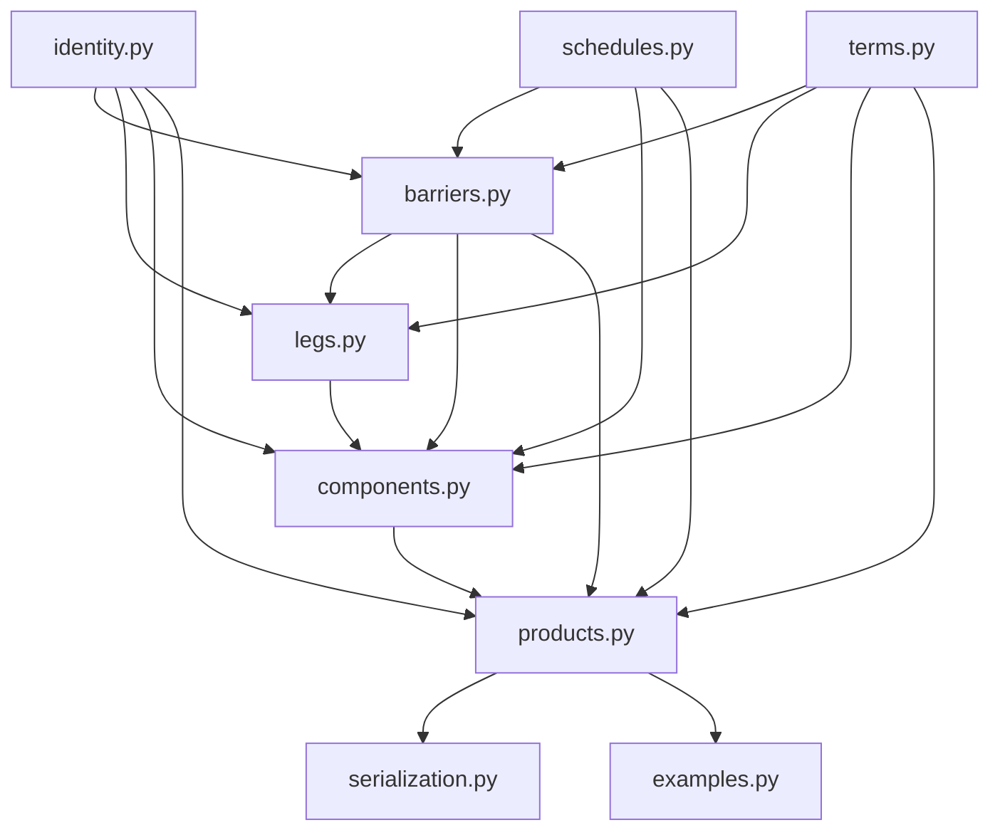
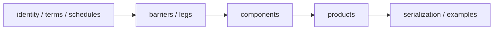
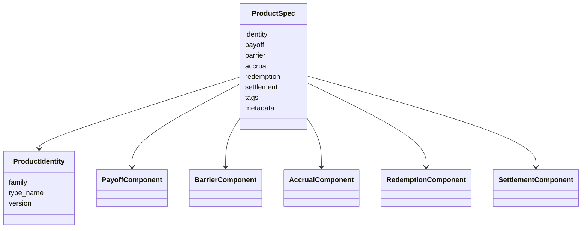

# contracts_ext README

この README は、`contracts_ext/` パッケージの設計意図、ドメインモデル、モジュール依存関係、主要クラス、使い方をまとめたものです。

このコードベースの主目的は、**プライシングではなく、トレード内容を過不足なく・宣言的に表現すること**です。  
そのため、実装の中心は「評価器」ではなく、

- 商品 family
- payoff / barrier / accrual / redemption / settlement の component
- time-varying parameter
- 未展開 / 展開済み schedule
- 永続化しやすい `to_dict()` / `from_dict()`

にあります。

---

## 目次

1. このコードで何を表現したいか
2. 設計原則
3. パッケージ構成
4. モジュール依存関係
5. ドメインモデル
6. スケジュール設計
7. Leg / Payoff 設計
8. サポートする product family
9. 永続化の考え方
10. 典型コード例
11. モジュールごとの説明
12. 今後の拡張ポイント

---

# 1. このコードで何を表現したいか

このパッケージは、次のような商品を記述することを意図しています。

- TARF
- TARN
- AKO 付き Coupon Swap
- Interest Rate Swap
- PRDC
- Range Accrual Note
- FX option strategy / structured FX payoff

さらに、以下のような variation を自然に表現できることを重視しています。

- strike が途中で変わる
- ratio / leverage / spread / rate が途中で変わる
- schedule が変則
- AKO 観測開始が契約開始より後ろ
- AKO / KI 観測日が payoff 日と一致しない
- schedule を未展開の spec のまま持ちたい
- holiday calendar や business day adjustment を schedule spec に持ちたい
- fixed leg / floating leg / formula leg を同じ骨格で持ちたい
- coupon formula に FX や CMS を入れたい

このため、商品をテンプレート名と巨大なパラメータ袋で持つのではなく、

**component composition + typed family facade**

として表します。

---

# 2. 設計原則

## 2.1 商品は component の合成として表す

中核は `ProductSpec` です。

```python
ProductSpec(
    identity=...,
    payoff=...,
    barrier=...,
    accrual=...,
    redemption=...,
    settlement=...,
)
```

つまり商品は

- payoff component
- barrier component
- accrual component
- redemption component
- settlement component

の合成です。

---

## 2.2 pricing はしない

このコードは、あくまで**契約記述**が目的です。  
したがって、以下は含みません。

- market data evaluation
- payoff calculation
- Monte Carlo
- PDE / tree
- risk measure calculation

代わりに、**何を観測し、どういう payoff / coupon の骨格を持ち、どういう redemption / settlement なのか**を記述します。

---

## 2.3 family と variation を分離する

たとえば「TARF の strike が途中で変わる」場合、それは still TARF と見なしたいです。  
そのため、

- 何の商品か → `ProductIdentity.family`
- どこが変形か → `Term`, `ScheduleSpec`, `BarrierSpec`, `LegSpec`

で表します。

---

## 2.4 schedule は未展開 / 展開済みを分ける

スケジュールは 2 層に分かれます。

- **未展開 spec**
  - `PeriodicScheduleSpec`
  - `ExplicitEventScheduleSpec`
- **展開済み concrete schedule**
  - `EventSchedule`
  - `ObservationDates`

こうすることで、

- ビジネスデイ調整
- holiday calendar
- settlement lag
- payoff index 基準の step
- delayed observation

を自然に表現できます。

---

## 2.5 time-varying parameter は `Term` で表す

固定値も途中変更も同じインターフェースで表せます。

主な `Term` は次の通りです。

- `ConstantTerm`
- `StepByIndexTerm`
- `DateRangeTerm`
- `FormulaTerm`

特に `StepByIndexTerm` は **payoff index 基準**です。  
日付ではなく、「第何 payoff から変わるか」で指定します。

---

## 2.6 payoff の中心は generic leg composition

FX 専用の商品だけではなく、IRS や PRDC を表現するために、
leg を次のように一般化しています。

- `FXForwardLegSpec`
- `FXOptionLegSpec`
- `FixedRateLegSpec`
- `FloatingRateLegSpec`
- `FormulaLegSpec`

その上で payoff component は次の 3 種を持ちます。

- `FXStructuredPayoff`
- `GenericMultiLegPayoff`
- `RangeCouponPayoff`

---

# 3. パッケージ構成

```text
contracts_ext/
  __init__.py
  identity.py
  terms.py
  schedules.py
  barriers.py
  legs.py
  components.py
  products.py
  serialization.py
  examples.py
  README.md
```

---

# 4. モジュール依存関係



役割ベースで見ると次の通りです。



意味としては、

- `identity`, `terms`, `schedules` は**土台**
- `barriers`, `legs` は**payoff/coupon の部品**
- `components` は**商品記述の中核**
- `products` は**family ごとの facade**
- `serialization`, `examples` は**利用補助**

です。

---

# 5. ドメインモデル

このコードのドメインモデルは、ざっくりこう整理できます。



---

## 5.1 ProductIdentity

`ProductIdentity` は商品 family を表します。

例:

- `family="TARF"`
- `family="TARN"`
- `family="INTEREST_RATE_SWAP"`
- `family="PRDC"`

この `family` は「この契約が何者なのか」を表す最上位タグです。

---

## 5.2 ProductSpec

`ProductSpec` は component composition の中心です。

責務は次の通りです。

- family と components を束ねる
- family ごとの validation を行う
- 永続化しやすい dict へ変換する

`ProductSpec` 自体は汎用の契約記述コンテナです。

---

## 5.3 typed facade

利用者がいきなり `ProductSpec(...)` を組み立てるのはやや重いので、
`products.py` に family ごとの facade を置いています。

- `TARFSpec`
- `TARNSpec`
- `AKOCouponSwapSpec`
- `InterestRateSwapSpec`
- `PRDCNoteSpec`
- `RangeAccrualNoteSpec`

これらは、

- family ごとの自然な constructor を提供する
- その family にふさわしい component の組を作る
- `ProductSpec` へ落とす

役割です。

---

# 6. スケジュール設計

スケジュールはこのパッケージのかなり重要な部分です。

---

## 6.1 EventSchedule

`EventSchedule` は**展開済み**の payoff event 列です。

```python
EventSchedule(
    items=(
        (0, event_date_0, settlement_date_0),
        (1, event_date_1, settlement_date_1),
        ...
    ),
    role="tarf_fixing",
)
```

ここで重要なのは、各イベントに

- `payoff_index`
- `event_date`
- `settlement_date`

があることです。

この `payoff_index` が `StepByIndexTerm` の index と自然に対応します。

---

## 6.2 PeriodicScheduleSpec

`PeriodicScheduleSpec` は**未展開**のスケジュール spec です。

例:

```python
PeriodicScheduleSpec(
    start_date=date(2026, 1, 10),
    end_date=date(2026, 6, 10),
    frequency="monthly",
    settlement_lag_days=2,
    roll_convention="none",
    business_day_adjustment="following",
    holiday_calendar="TKY+NYC",
    role="tarf_fixing",
)
```

このレイヤーでは、まだ実際の日付列に展開しません。

---

## 6.3 ExplicitEventScheduleSpec

すでに展開済みの日付列を spec として持ちたいときに使います。

```python
ExplicitEventScheduleSpec(schedule=EventSchedule(...))
```

---

## 6.4 ObservationDates / ObservationWindowSpec

`ObservationDates` は観測日の単純な列です。  
`ObservationWindowSpec` は AKO や KI の観測窓です。

ポイントは、

- 観測日は payoff 日と一致していなくてよい
- 観測開始は payoff index でも日付でも指定できる

ことです。

---

## 6.5 RelativeStartSpec

観測開始を表す spec です。

```python
RelativeStartSpec(mode="by_payoff_index", payoff_index=1)
```

または

```python
RelativeStartSpec(mode="by_date", start_date=date(2026, 2, 7))
```

これにより、

- 契約開始後しばらくしてから KO / KI 観測開始
- payoff の 2 本目以降から観測開始
- payoff 日に一致しない日付から観測開始

が表せます。

---

# 7. Leg / Payoff 設計

今回の拡張で最も重要なのは、payoff の中心を **generic leg composition** に寄せたことです。

---

## 7.1 FX leg

- `FXForwardLegSpec`
- `FXOptionLegSpec`

これにより、

- normal
- gap
- two-stage
- collar

のような FX structured payoff を表せます。

---

## 7.2 Rate leg

- `FixedRateLegSpec`
- `FloatingRateLegSpec`

これにより、IRS や coupon swap のレグを自然に表せます。

固定 leg は

- pay/receive
- notional
- fixed rate
- day count

を持ちます。

変動 leg は

- pay/receive
- notional
- index
- spread
- leverage
- cap / floor
- reset timing

を持ちます。

---

## 7.3 Formula leg

- `FormulaLegSpec`

これは PRDC のように、

- coupon が FX と CMS の式で決まる
- redemption leg も別の式で表したい

ケースを想定しています。

`formula_name` と `formula_inputs` を持つことで、pricing engine とは独立に
「契約上の計算骨格」を保存できます。

---

## 7.4 payoff component

payoff component は次の 3 つです。

### FXStructuredPayoff

FX 向け。`payoff_style` と FX legs を持ちます。

### GenericMultiLegPayoff

IRS / PRDC / multi-leg coupon product 向け。  
legs の tuple をそのまま持つ汎用コンテナです。

### RangeCouponPayoff

range accrual 的な coupon を直接表したいときの専用 component です。

---

# 8. サポートする product family

現在の `ProductSpec.validate()` でサポートしている family は次の通りです。

---

## 8.1 TARF

基本構成:

- payoff: `FXStructuredPayoff`
- accrual: `PositivePnLAccrual`
- redemption: `TargetHitRedemption`
- settlement: `FinalFixingSettlement`

---

## 8.2 TARN

基本構成:

- payoff: `FXStructuredPayoff` または `GenericMultiLegPayoff` または `RangeCouponPayoff`
- accrual: `PositivePnLAccrual` または `CouponAccrual`
- redemption: `TargetHitRedemption`

---

## 8.3 AKO_COUPON_SWAP

基本構成:

- payoff: `FXStructuredPayoff` / `RangeCouponPayoff` / `GenericMultiLegPayoff`
- barrier: `AKOBarrier`
- accrual: `CouponAccrual`
- redemption: `BarrierTriggeredRedemption` or `NoRedemption`
- settlement: `StandardSettlement`

---

## 8.4 INTEREST_RATE_SWAP

基本構成:

- payoff: `GenericMultiLegPayoff`
- legs: `FixedRateLegSpec`, `FloatingRateLegSpec`
- accrual: `CouponAccrual`
- barrier: `NoBarrier`
- redemption: `NoRedemption`

この family で、fixed-float IRS を自然に表せます。

---

## 8.5 PRDC

基本構成:

- payoff: `GenericMultiLegPayoff`
- legs: 少なくとも 1 本の `FormulaLegSpec`
- accrual: `CouponAccrual`
- barrier: `NoBarrier`
- settlement: `StandardSettlement`

ここでは PRDC の coupon / redemption を formula leg で保持します。

---

## 8.6 RANGE_ACCRUAL_NOTE

基本構成:

- payoff: `RangeCouponPayoff`
- accrual: `CouponAccrual`
- redemption: `NoRedemption`
- settlement: `StandardSettlement`

---

## 8.7 FX_OPTION_STRATEGY

基本構成:

- payoff: `FXStructuredPayoff`

将来的に vanilla / collar / seagull などを family として分けたい場合の受け皿です。

---

# 9. 永続化の考え方

このパッケージでは、永続化の正本は **Python オブジェクトそのものではなく dict 表現**です。

つまり保存対象は

```python
ProductSpec.to_dict()
```

の結果です。

これにより、

- pickle に依存しない
- クラス定義変更に比較的強い
- 監査しやすい
- 差分比較しやすい
- 他言語に渡しやすい

というメリットがあります。

---

## 9.1 保存の基本方針

推奨フローは次の通りです。

1. `TARFSpec` / `InterestRateSwapSpec` / `PRDCNoteSpec` などを作る
2. `to_product_spec()` する
3. `validate()` する
4. `to_dict()` を JSON 化して保存する

---

## 9.2 復元の基本方針

1. JSON から dict を読む
2. `ProductSpec.from_dict()` する
3. 必要なら family facade に戻す

---

# 10. 典型コード例

## 10.1 IRS

```python
from datetime import date

from contracts_ext.identity import ProductIdentity, RateIndexRef
from contracts_ext.products import InterestRateSwapSpec, make_fixed_float_swap_payoff
from contracts_ext.schedules import PeriodicScheduleSpec
from contracts_ext.terms import ConstantTerm

payoff = make_fixed_float_swap_payoff(
    schedule_spec=PeriodicScheduleSpec(
        start_date=date(2026, 1, 5),
        end_date=date(2031, 1, 5),
        frequency="semiannual",
        settlement_lag_days=2,
        holiday_calendar="NYC",
        role="irs_coupon",
    ),
    fixed_currency="USD",
    float_currency="USD",
    notional=ConstantTerm(100_000_000.0),
    fixed_rate=ConstantTerm(0.0325),
    float_index=RateIndexRef("SOFR", "USD", "3M", "ACT/360"),
    pay_fixed=True,
)

trade = InterestRateSwapSpec(
    identity=ProductIdentity("INTEREST_RATE_SWAP", "FixedFloatIRS"),
    payoff=payoff,
    settlement_currency="USD",
)

spec = trade.to_product_spec()
```

---

## 10.2 PRDC

```python
from datetime import date

from contracts_ext.identity import CmsIndexRef, ProductIdentity, UnderlyingRef
from contracts_ext.products import PRDCNoteSpec, make_prdc_payoff
from contracts_ext.schedules import PeriodicScheduleSpec
from contracts_ext.terms import ConstantTerm

payoff = make_prdc_payoff(
    schedule_spec=PeriodicScheduleSpec(
        start_date=date(2026, 4, 15),
        end_date=date(2036, 4, 15),
        frequency="annual",
        settlement_lag_days=2,
        holiday_calendar="TKY+NYC",
        role="prdc_coupon",
    ),
    coupon_currency="JPY",
    redemption_currency="USD",
    notional=ConstantTerm(1_000_000_000.0),
    domestic_index=CmsIndexRef("JPY CMS", "JPY", "10Y"),
    fx_underlying=UnderlyingRef("USDJPY", "FX"),
    coupon_floor=ConstantTerm(0.0),
    coupon_cap=ConstantTerm(0.12),
)

trade = PRDCNoteSpec(
    identity=ProductIdentity("PRDC", "PRDCNote"),
    payoff=payoff,
    settlement_currency="JPY",
    callable_style="bermudan",
)
```

---

## 10.3 TARF

```python
from datetime import date

from contracts_ext.identity import ProductIdentity, UnderlyingRef
from contracts_ext.products import TARFSpec, make_two_stage_payoff
from contracts_ext.schedules import PeriodicScheduleSpec
from contracts_ext.terms import ConstantTerm, StepByIndexTerm

payoff = make_two_stage_payoff(
    underlying=UnderlyingRef("USDJPY", "FX"),
    schedule_spec=PeriodicScheduleSpec(
        start_date=date(2026, 1, 10),
        end_date=date(2026, 6, 10),
        frequency="monthly",
        settlement_lag_days=2,
        holiday_calendar="TKY+NYC",
        role="tarf_fixing",
    ),
    settlement_currency="JPY",
    base_notional=ConstantTerm(1_000_000.0),
    strike_steps=StepByIndexTerm(((0, 145.0), (3, 147.0))),
    ratio=ConstantTerm(2.0),
)

trade = TARFSpec(
    identity=ProductIdentity("TARF", "TargetRedemptionForward"),
    payoff=payoff,
    target=ConstantTerm(5_000_000.0),
)
```

---

# 11. モジュールごとの説明

## `identity.py`

役割:

- 商品 identity
- underlier / index の参照子

主なクラス:

- `ProductIdentity`
- `UnderlyingRef`
- `RateIndexRef`
- `CmsIndexRef`

---

## `terms.py`

役割:

- time-varying parameter を表す

主なクラス:

- `ConstantTerm`
- `StepByIndexTerm`
- `DateRangeTerm`
- `FormulaTerm`

---

## `schedules.py`

役割:

- schedule の spec と concrete form を扱う

主なクラス:

- `EventSchedule`
- `ObservationDates`
- `PeriodicScheduleSpec`
- `ExplicitEventScheduleSpec`
- `RelativeStartSpec`
- `ObservationWindowSpec`

---

## `barriers.py`

役割:

- leg-level / product-level barrier を表す

主なクラス:

- `NoLegBarrier`
- `EuropeanKnockInLegBarrier`
- `NoBarrier`
- `EuropeanKnockInBarrier`
- `AKOBarrier`

---

## `legs.py`

役割:

- payoff / coupon leg を表す

主なクラス:

- `FXForwardLegSpec`
- `FXOptionLegSpec`
- `FixedRateLegSpec`
- `FloatingRateLegSpec`
- `FormulaLegSpec`

---

## `components.py`

役割:

- component composition の中核
- family ごとの validation

主なクラス:

- `FXStructuredPayoff`
- `GenericMultiLegPayoff`
- `RangeCouponPayoff`
- `PositivePnLAccrual`
- `CouponAccrual`
- `TargetHitRedemption`
- `BarrierTriggeredRedemption`
- `StandardSettlement`
- `FinalFixingSettlement`
- `ProductSpec`

---

## `products.py`

役割:

- family ごとの typed facade
- convenience constructor

主なクラス / 関数:

- `TARFSpec`
- `TARNSpec`
- `AKOCouponSwapSpec`
- `InterestRateSwapSpec`
- `PRDCNoteSpec`
- `RangeAccrualNoteSpec`
- `make_normal_payoff`
- `make_two_stage_payoff`
- `make_gap_payoff`
- `make_fixed_float_swap_payoff`
- `make_prdc_payoff`

---

## `serialization.py`

役割:

- `to_dict()` / `from_dict()` の薄いラッパー

---

## `examples.py`

役割:

- 典型例の提供
- 設計の executable documentation

---

# 12. 今後の拡張ポイント

## 12.1 schedule 展開器

現状は `PeriodicScheduleSpec` を持てますが、実際の日付列へ展開する engine は別です。

将来的には

- business day adjustment engine
- holiday calendar resolver
- settlement lag applier

を別モジュールで追加できます。

---

## 12.2 validation の強化

現在の validation は主に構造チェックです。  
将来的には、

- cross-currency consistency
- coupon formula input の必須項目チェック
- notional / settlement currency consistency
- payoff schedule と observation window の整合性
- callable / redemption rule の整合性

などを追加できます。

---

## 12.3 product family の追加

この骨格なら、たとえば次も足しやすいです。

- Cross Currency Swap
- Basis Swap
- Snowball / autocall
- CMS spread note
- callable range accrual
- equity-linked note

---

## 12.4 pricing layer との分離連携

このコードは pricing をしませんが、将来的に pricing layer を追加するなら、

```text
Family facade
    -> ProductSpec
        -> compiled pricing IR
            -> pricer
```

という流れが自然です。

つまり、このパッケージは pricing layer の前段の
**契約意味論の正本**
として使うのがよいです。

---

# まとめ

この `contracts_ext/` パッケージは、商品を

- family
- component composition
- generic leg set
- time-varying term
- schedule spec
- leg-level / product-level barrier

として記述するための基盤です。

特に重要なのは次の点です。

- 商品は `ProductSpec` の component 合成として表す
- payoff は FX 専用だけでなく `GenericMultiLegPayoff` でも持てる
- IRS は fixed / floating leg で自然に表せる
- PRDC は formula leg を用いて coupon / redemption の骨格を持てる
- TARN / TARF は target redemption 系として共通枠で扱える
- AKO 観測開始を payoff index または日付で指定できる
- 永続化の正本は dict / JSON 表現である

この設計により、**TARF から IRS, PRDC, range accrual 系までを、pricing とは独立に、宣言的かつ拡張可能に表現**できます。
