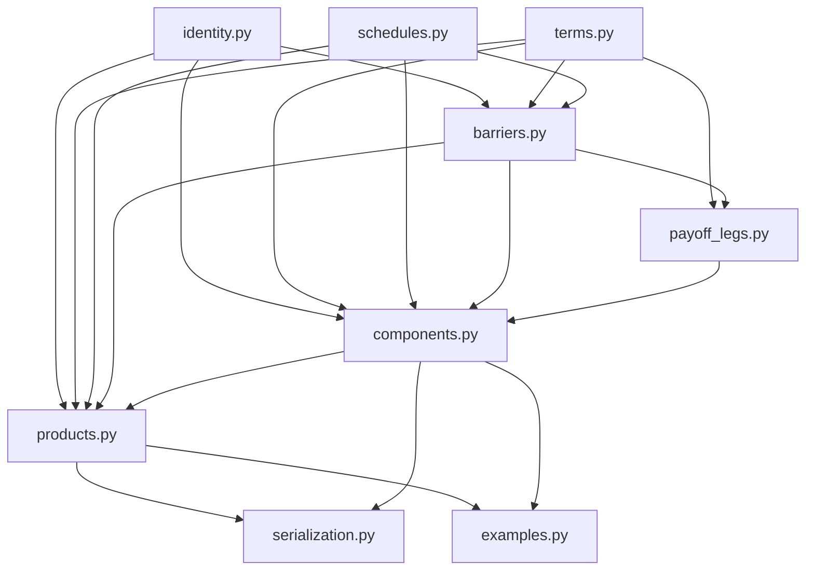
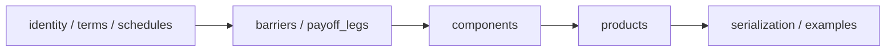
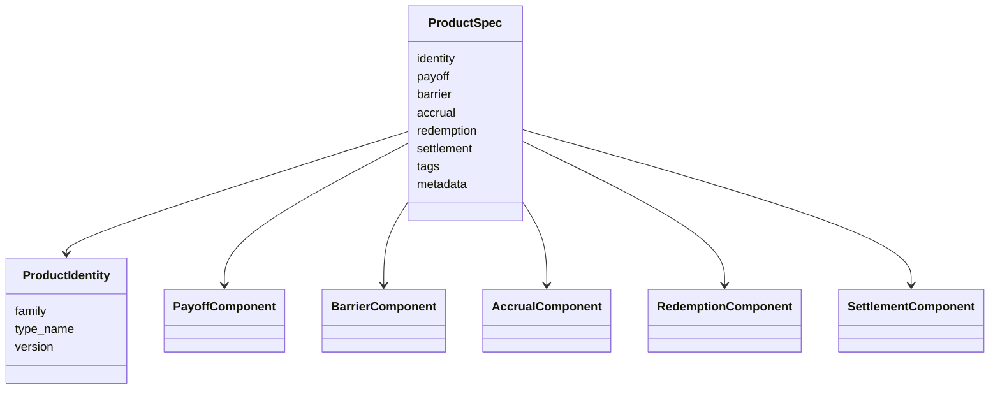

# contracts README

この README は、`contracts/` パッケージの設計意図、ドメインモデル、モジュール依存関係、主要クラス、使い方をまとめたものです。

このコードベースの主目的は、**プライシングではなく、トレード内容を過不足なく・宣言的に表現すること**です。  
そのため、実装の中心は「評価器」ではなく、

- 商品 family
- payoff / barrier / accrual / redemption / settlement の component
- time-varying parameter
- 未展開 / 展開済み schedule
- 永続化しやすい `to_dict()` / `from_dict()`

にあります。

---

## 目次

1. このコードで何を表現したいか
2. 設計原則
3. パッケージ構成
4. モジュール依存関係
5. ドメインモデル
6. スケジュール設計
7. Payoff 設計
8. TARF と AKO Coupon Swap の位置づけ
9. 永続化の考え方
10. 典型コード例
11. モジュールごとの説明
12. 今後の拡張ポイント

---

# 1. このコードで何を表現したいか

このパッケージは、たとえば次のような商品を記述することを意図しています。

- TARF
- AKO 付き Coupon Swap
- それらの中で使われる various payoff style
  - normal
  - GAP
  - range GAP
  - collar
  - two-stage

さらに、以下のような「軽い変形」を自然に表現できることを重視しています。

- strike が途中で変わる
- ratio / leverage が途中で変わる
- schedule が変則
- AKO 観測開始が契約開始より後ろ
- AKO / KI 観測日が payoff 日と一致しない
- schedule を未展開の spec のまま持ちたい
- holiday calendar や business day adjustment を schedule spec に持ちたい

このため、商品を単なるテンプレート名や巨大なパラメータ袋として持つのではなく、

**component composition**
として表します。

---

# 2. 設計原則

このコードの設計原則は次の通りです。

## 2.1 商品は component の合成として表す

中核は `ProductSpec` です。

```python
ProductSpec(
    identity=...,
    payoff=...,
    barrier=...,
    accrual=...,
    redemption=...,
    settlement=...,
)
````

つまり商品は

* payoff component
* barrier component
* accrual component
* redemption component
* settlement component

の合成です。

---

## 2.2 pricing はしない

このコードは、あくまで**契約記述**が目的です。
したがって、以下は含みません。

* market data evaluation
* payoff calculation
* Monte Carlo
* PDE / tree
* risk measure calculation

代わりに、**何を観測し、どういう payoff の骨格を持ち、どういう redemption / settlement なのか**を記述します。

---

## 2.3 family と variation を分離する

たとえば「TARF の strike が途中で変わる」場合、それは普通 still TARF と見なしたいです。
そのため、

* 何の商品か → `ProductIdentity.family`
* どこが変形か → `Term`, `ScheduleSpec`, `BarrierSpec`, `FXLegSpec`

で表します。

---

## 2.4 schedule は未展開 / 展開済みを分ける

スケジュールは2層に分かれます。

* **未展開 spec**

  * `PeriodicScheduleSpec`
  * `ExplicitEventScheduleSpec`
* **展開済み concrete schedule**

  * `EventSchedule`
  * `ObservationDates`

こうすることで、

* ビジネスデイ調整
* holiday calendar
* settlement lag
* payoff index 基準の step
* delayed observation

を自然に表現できます。

---

## 2.5 time-varying parameter は `Term` で表す

固定値も途中変更も同じインターフェースで表せます。

主な `Term` は次の通りです。

* `ConstantTerm`
* `StepByIndexTerm`
* `DateRangeTerm`

特に `StepByIndexTerm` は **payoff index 基準**です。
日付ではなく、「第何 payoff から変わるか」で指定します。

---

# 3. パッケージ構成

```text
contracts/
  __init__.py
  identity.py
  terms.py
  schedules.py
  barriers.py
  payoff_legs.py
  components.py
  products.py
  serialization.py
  examples.py
```

---

# 4. モジュール依存関係

大まかな依存は次の通りです。



もう少し役割ベースで見るとこうです。



意味としては、

* `identity`, `terms`, `schedules` は**土台**
* `barriers`, `payoff_legs` は**payoff の部品**
* `components` は**商品記述の中核**
* `products` は**family ごとの facade**
* `serialization`, `examples` は**利用補助**

です。

---

# 5. ドメインモデル

このコードのドメインモデルは、ざっくりこう整理できます。



---

## 5.1 ProductIdentity

`ProductIdentity` は商品 family を表します。

例:

* `family="TARF"`
* `family="AKO_COUPON_SWAP"`

この `family` は非常に重要です。
これは「この契約が何者なのか」を表す最上位タグです。

---

## 5.2 ProductSpec

`ProductSpec` は component composition の中心です。

責務は次の通りです。

* family と components を束ねる
* family ごとの validation を行う
* 永続化しやすい dict へ変換する

`ProductSpec` 自体は「TARF 用」ではなく、**汎用の契約記述コンテナ**です。

---

## 5.3 typed facade

ユーザコードからいきなり `ProductSpec(...)` を組み立てるのはややつらいので、
`products.py` に family ごとの facade を置いています。

* `TARFSpec`
* `AKOCouponSwapSpec`

これらは、

* family ごとの自然な constructor を提供する
* その family にふさわしい component の組を作る
* `ProductSpec` へ落とす

役割です。

---

# 6. スケジュール設計

スケジュールはこのパッケージのかなり重要な部分です。

---

## 6.1 EventSchedule

`EventSchedule` は**展開済み**の payoff event 列です。

```python
EventSchedule(
    items=(
        (0, event_date_0, settlement_date_0),
        (1, event_date_1, settlement_date_1),
        ...
    ),
    role="tarf_fixing",
)
```

ここで重要なのは、各イベントに

* `payoff_index`
* `event_date`
* `settlement_date`

があることです。

この `payoff_index` が、`StepByIndexTerm` の index と自然に対応します。

---

## 6.2 PeriodicScheduleSpec

`PeriodicScheduleSpec` は**未展開**のスケジュール spec です。

例:

```python
PeriodicScheduleSpec(
    start_date=date(2026, 1, 10),
    end_date=date(2026, 6, 10),
    frequency="monthly",
    settlement_lag_days=2,
    roll_convention="none",
    business_day_adjustment="following",
    holiday_calendar="TKY+NYC",
    role="tarf_fixing",
)
```

このレイヤーでは、まだ実際の日付列に展開しません。

つまりこれは、

* 月次
* settlement lag 2日
* following 調整
* Tokyo / New York calendar

という**日付生成ルールの記述**です。

---

## 6.3 ExplicitEventScheduleSpec

すでに展開済みの日付列を spec として持ちたいときに使います。

```python
ExplicitEventScheduleSpec(
    schedule=EventSchedule(...)
)
```

未展開にしたいケースもあれば、
外部システムから already-fixed な日付列が来るケースもあるので、両方持てるようにしています。

---

## 6.4 ObservationDates

`ObservationDates` は観測日の単純な列です。
AKO や KI 観測などに使います。

payoff schedule と一致している必要はありません。

---

## 6.5 ObservationWindowSpec

これは今回追加した重要な概念です。

AKO や leg-level KI の観測窓を表します。

```python
ObservationWindowSpec(
    observation_dates=ObservationDates(...),
    start_spec=RelativeStartSpec(...),
    end_date=...,
    role="ako_window",
)
```

ポイントは、

* 観測日は payoff 日と一致しなくてよい
* 観測開始は payoff index でも日付でも指定できる

ことです。

---

## 6.6 RelativeStartSpec

観測開始を表す spec です。

```python
RelativeStartSpec(mode="by_payoff_index", payoff_index=1)
```

または

```python
RelativeStartSpec(mode="by_date", start_date=date(2026, 2, 7))
```

これにより、

* 契約開始後しばらくしてから KO 観測開始
* payoff の 2本目以降から観測開始
* payoff 日に一致しない日付から観測開始

が表せます。

---

# 7. Payoff 設計

今回の payoff 設計の中心は `FXStructuredPayoff` です。

---

## 7.1 なぜ leg の束なのか

以前のように payoff を「1本の式」として持つと、

* normal
* GAP
* range GAP
* collar
* two-stage

をきれいに統一できません。

そこで payoff を、

**leg の束**
として表します。

```python
FXStructuredPayoff(
    underlying=...,
    payoff_style="gap",
    schedule_spec=...,
    settlement_currency="JPY",
    base_notional=...,
    legs=(..., ...),
)
```

---

## 7.2 FXForwardLegSpec

forward-like leg を表します。

```python
FXForwardLegSpec(
    position="sell_base",
    strike=ConstantTerm(145.0),
    quantity_multiplier=ConstantTerm(2.0),
)
```

これで normal や two-stage のレシオフォワードを表せます。

---

## 7.3 FXOptionLegSpec

option leg を表します。

```python
FXOptionLegSpec(
    option_type="put",
    position="sell",
    strike=ConstantTerm(150.0),
    quantity_multiplier=ConstantTerm(2.0),
    barrier=EuropeanKnockInLegBarrier(...),
)
```

ここで重要なのは、**leg に barrier を直接付けられる**ことです。
これにより、「put にだけ KI」が自然に表現できます。

---

## 7.4 payoff_style

`FXStructuredPayoff` は `payoff_style` を持ちます。

* `normal`
* `gap`
* `range_gap`
* `collar`
* `two_stage`
* `custom`

これは名前を残しつつ、内部的には leg composition で表すためのものです。

---

## 7.5 各 style の意味

### normal

* leg は 1 本
* `FXForwardLegSpec`
* レシオフォワード

### two_stage

* leg は 1 本
* `FXForwardLegSpec`
* strike は `StepByIndexTerm`

### gap

* call buy
* put sell
* call strike < put strike
* put にのみ European KI

### range_gap

* call buy
* put sell
* call strike == put strike
* put にのみ European KI

### collar

* call buy
* put sell
* call strike > put strike
* barrier なし

---

# 8. TARF と AKO Coupon Swap の位置づけ

このコードでは、TARF と AKOCS は payoff 自体で区別するというより、

**payoff の上に何を載せるか**
で区別します。

---

## 8.1 TARF

TARF は基本的に

* payoff: `FXStructuredPayoff`
* accrual: `PositivePnLAccrual`
* redemption: `TargetHitRedemption`
* settlement: `FinalFixingSettlement`

です。

つまり TARF らしさは、

* target redemption
* positive PnL accumulation
* final fixing treatment

にあります。

payoff は normal でも gap でも collar でも two-stage でもよい、という立て付けです。

---

## 8.2 AKO Coupon Swap

AKOCS は基本的に

* payoff: `FXStructuredPayoff` または `RangeCouponPayoff`
* barrier: `AKOBarrier`
* accrual: `CouponAccrual`
* redemption: `BarrierTriggeredRedemption` または `NoRedemption`
* settlement: `StandardSettlement`

です。

つまり AKOCS らしさは、

* AKO barrier
* coupon accrual
* AKO 発火後の扱い

にあります。

---

# 9. 永続化の考え方

このパッケージでは、永続化の正本は **Python オブジェクトそのものではなく dict 表現**です。

つまり保存対象は

```python
ProductSpec.to_dict()
```

の結果です。

これにより、

* pickle に依存しない
* クラス定義変更に比較的強い
* 監査しやすい
* 差分比較しやすい
* 他言語に渡しやすい

というメリットがあります。

---

## 9.1 保存の基本方針

推奨フローは次の通りです。

1. `TARFSpec` / `AKOCouponSwapSpec` を作る
2. `to_product_spec()` する
3. `validate()` する
4. `to_dict()` を JSON 化して保存する

---

## 9.2 復元の基本方針

1. JSON から dict を読む
2. `ProductSpec.from_dict()` する
3. 必要なら `TARFSpec.from_product_spec()` / `AKOCouponSwapSpec.from_product_spec()` で facade に戻す

---

# 10. 典型コード例

---

## 10.1 two-stage TARF（未展開 schedule）

```python
from datetime import date

from contracts.identity import ProductIdentity, UnderlyingRef
from contracts.products import TARFSpec, make_two_stage_payoff
from contracts.schedules import PeriodicScheduleSpec
from contracts.terms import ConstantTerm, StepByIndexTerm

payoff = make_two_stage_payoff(
    underlying=UnderlyingRef("USDJPY", "FX"),
    schedule_spec=PeriodicScheduleSpec(
        start_date=date(2026, 1, 10),
        end_date=date(2026, 6, 10),
        frequency="monthly",
        settlement_lag_days=2,
        business_day_adjustment="following",
        holiday_calendar="TKY+NYC",
        role="tarf_fixing",
    ),
    settlement_currency="JPY",
    base_notional=ConstantTerm(1_000_000.0),
    strike_steps=StepByIndexTerm(((0, 145.0), (3, 147.0))),
    ratio=ConstantTerm(2.0),
)

trade = TARFSpec(
    identity=ProductIdentity("TARF", "TargetRedemptionForward", "1.1"),
    payoff=payoff,
    target=ConstantTerm(5_000_000.0),
    final_fixing_treatment="full",
)

spec = trade.to_product_spec()
data = spec.to_dict()
```

---

## 10.2 AKO coupon swap（観測開始を payoff index で指定）

```python
from datetime import date

from contracts.identity import ProductIdentity, UnderlyingRef
from contracts.products import AKOCouponSwapSpec, make_gap_payoff
from contracts.schedules import (
    EventSchedule,
    ExplicitEventScheduleSpec,
    ObservationDates,
    ObservationWindowSpec,
    RelativeStartSpec,
)
from contracts.terms import ConstantTerm

payoff = make_gap_payoff(
    underlying=UnderlyingRef("USDJPY", "FX"),
    schedule_spec=ExplicitEventScheduleSpec(
        schedule=EventSchedule(
            items=(
                (0, date(2026, 1, 15), date(2026, 1, 20)),
                (1, date(2026, 4, 15), date(2026, 4, 20)),
                (2, date(2026, 7, 15), date(2026, 7, 21)),
                (3, date(2026, 10, 15), date(2026, 10, 20)),
            ),
            role="coupon_fixing",
        )
    ),
    settlement_currency="JPY",
    base_notional=ConstantTerm(10_000_000.0),
    call_strike=ConstantTerm(145.0),
    put_strike=ConstantTerm(150.0),
    call_ratio=ConstantTerm(1.0),
    put_ratio=ConstantTerm(2.0),
    put_ki_trigger=ConstantTerm(130.0),
    put_ki_observation_window=ObservationWindowSpec(
        observation_dates=ObservationDates(
            dates=(
                date(2026, 1, 15),
                date(2026, 4, 15),
                date(2026, 7, 15),
                date(2026, 10, 15),
            ),
            role="put_ki_observation",
        ),
        start_spec=RelativeStartSpec(mode="by_payoff_index", payoff_index=1),
        role="put_ki_window",
    ),
)

trade = AKOCouponSwapSpec(
    identity=ProductIdentity("AKO_COUPON_SWAP", "StructuredPayoffCouponSwapWithAKO", "1.1"),
    payoff=payoff,
    ako_trigger_level=ConstantTerm(128.0),
    ako_observation_window=ObservationWindowSpec(
        observation_dates=ObservationDates(
            dates=(
                date(2026, 2, 1),
                date(2026, 3, 1),
                date(2026, 5, 1),
                date(2026, 8, 1),
            ),
            role="ako_observation",
        ),
        start_spec=RelativeStartSpec(mode="by_payoff_index", payoff_index=1),
        role="ako_window",
    ),
    ako_breach_condition="spot_lte_level",
    ako_action_on_breach="cancel_remaining",
    redemption_on_ako=True,
    settlement_currency="JPY",
    accrual_factor_term=ConstantTerm(0.25),
)

spec = trade.to_product_spec()
```

---

## 10.3 AKO coupon swap（観測開始を日付で指定）

```python
from datetime import date

from contracts.identity import ProductIdentity, UnderlyingRef
from contracts.products import AKOCouponSwapSpec, make_normal_payoff
from contracts.schedules import (
    ObservationDates,
    ObservationWindowSpec,
    PeriodicScheduleSpec,
    RelativeStartSpec,
)
from contracts.terms import ConstantTerm

payoff = make_normal_payoff(
    underlying=UnderlyingRef("USDJPY", "FX"),
    schedule_spec=PeriodicScheduleSpec(
        start_date=date(2026, 1, 15),
        end_date=date(2026, 10, 15),
        frequency="quarterly",
        settlement_lag_days=5,
        business_day_adjustment="modified_following",
        holiday_calendar="TKY",
        role="coupon_fixing",
    ),
    settlement_currency="JPY",
    base_notional=ConstantTerm(10_000_000.0),
    strike=ConstantTerm(145.0),
    ratio=ConstantTerm(2.0),
    forward_position="sell_base",
)

trade = AKOCouponSwapSpec(
    identity=ProductIdentity("AKO_COUPON_SWAP", "NormalPayoffCouponSwapWithAKO", "1.1"),
    payoff=payoff,
    ako_trigger_level=ConstantTerm(128.0),
    ako_observation_window=ObservationWindowSpec(
        observation_dates=ObservationDates(
            dates=(
                date(2026, 2, 7),
                date(2026, 3, 7),
                date(2026, 4, 7),
                date(2026, 5, 7),
            ),
            role="ako_observation",
        ),
        start_spec=RelativeStartSpec(mode="by_date", start_date=date(2026, 2, 7)),
        role="ako_window",
    ),
    ako_breach_condition="spot_lte_level",
    ako_action_on_breach="cancel_remaining",
    redemption_on_ako=True,
    settlement_currency="JPY",
    accrual_factor_term=ConstantTerm(0.25),
)
```

---

# 11. モジュールごとの説明

---

## `identity.py`

### 役割

ドメイン内で広く使われる識別子を定義します。

### 主なクラス

* `ProductIdentity`
* `UnderlyingRef`

### ドメイン的意味

* `ProductIdentity` は「何の商品 family か」
* `UnderlyingRef` は「何を underlying として参照するか」

---

## `terms.py`

### 役割

time-varying parameter を表します。

### 主なクラス

* `ConstantTerm`
* `StepByIndexTerm`
* `DateRangeTerm`

### ドメイン的意味

「途中で strike が変わる」「後半だけ ratio が変わる」といった variation を、
family を壊さずに表現するための仕組みです。

---

## `schedules.py`

### 役割

schedule の spec と concrete form を扱います。

### 主なクラス

* `EventSchedule`
* `ObservationDates`
* `ExplicitEventScheduleSpec`
* `PeriodicScheduleSpec`
* `RelativeStartSpec`
* `ObservationWindowSpec`

### ドメイン的意味

「日付列そのもの」と「日付列の作り方」を分離することで、
holiday calendar や delayed observation をきれいに持てるようにしています。

---

## `barriers.py`

### 役割

barrier を表します。

### 主なクラス

* leg-level:

  * `NoLegBarrier`
  * `EuropeanKnockInLegBarrier`
* product-level:

  * `NoBarrier`
  * `EuropeanKnockInBarrier`
  * `AKOBarrier`

### ドメイン的意味

payoff leg に付く barrier と、
商品全体の barrier を分けています。

これにより、「put にだけ KI」「商品全体として AKO」が共存できます。

---

## `payoff_legs.py`

### 役割

FX structured payoff を構成する leg を表します。

### 主なクラス

* `FXForwardLegSpec`
* `FXOptionLegSpec`

### ドメイン的意味

normal / gap / range_gap / collar / two-stage を
「leg の組」として統一的に記述するための部品です。

---

## `components.py`

### 役割

component composition の中核です。

### 主なクラス

* `FXStructuredPayoff`
* `RangeCouponPayoff`
* `PositivePnLAccrual`
* `CouponAccrual`
* `TargetHitRedemption`
* `BarrierTriggeredRedemption`
* `FinalFixingSettlement`
* `StandardSettlement`
* `ProductSpec`

### ドメイン的意味

商品本体はここで組み立てられます。
このモジュールが「契約の意味論を失わない宣言的表現」の中心です。

---

## `products.py`

### 役割

family ごとの typed facade を提供します。

### 主なクラス / 関数

* `TARFSpec`
* `AKOCouponSwapSpec`
* `make_normal_payoff`
* `make_two_stage_payoff`
* `make_gap_payoff`
* `make_range_gap_payoff`
* `make_collar_payoff`

### ドメイン的意味

利用者はここから「自然な商品構築」を行います。
内部では `ProductSpec` に変換されます。

---

## `serialization.py`

### 役割

`to_dict()` / `from_dict()` を利用しやすくする薄いラッパーです。

### ドメイン的意味

永続化は dict / JSON を正本にする、という方針を補助します。

---

## `examples.py`

### 役割

典型例をまとめたサンプルです。

### ドメイン的意味

この設計が実際にどう使われるかを示します。
設計の生きた仕様書でもあります。

---

# 12. 今後の拡張ポイント

この設計はまだ拡張可能です。主な方向は次の通りです。

---

## 12.1 schedule 展開器

今は `PeriodicScheduleSpec` を持てますが、
それを `EventSchedule` に展開する機能は別途必要です。

たとえば将来的には

* business day adjustment engine
* holiday calendar resolver
* settlement lag applier

を別モジュールで実装できます。

---

## 12.2 stricter validation

現在の validation は主に構造チェックです。
将来的には、

* `StepByIndexTerm` 同士の strike relation check
* observation window と payoff schedule の整合 check
* currency / underlying consistency

なども追加できます。

---

## 12.3 richer Term

今は

* constant
* step_by_payoff_index
* date_range

ですが、将来的には

* formula term
* enum term
* lookup term
* conditional term

を足せます。

---

## 12.4 pricing layer との分離連携

このコードは pricing をしませんが、将来的に pricing layer を追加するなら、

```text
TARFSpec / AKOCouponSwapSpec
    -> ProductSpec
        -> compiled pricing IR
            -> pricer
```

という流れが自然です。

つまり、このパッケージは pricing layer の前段の
**契約意味論の正本**
として使うのがよいです。

---

# まとめ

この `contracts/` パッケージは、商品を

* family
* component composition
* time-varying term
* schedule spec
* leg-level / product-level barrier

として記述するための基盤です。

特に重要なのは次の点です。

* 商品は `ProductSpec` の component 合成として表す
* payoff は `FXStructuredPayoff` で leg の束として表す
* normal / gap / range_gap / collar / two-stage を同じ骨格で扱う
* AKO 観測開始を payoff index または日付で指定できる
* schedule を未展開のまま保持できる
* 永続化の正本は dict / JSON 表現である

この設計により、**TARF や AKO Coupon Swap のような構造化商品を、pricing とは独立に、宣言的かつ拡張可能に表現**できます。

```
```
